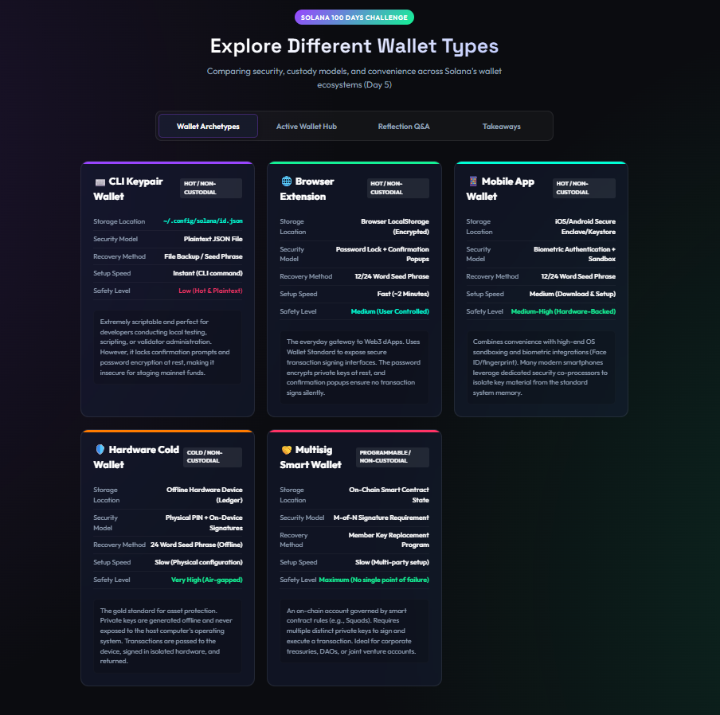
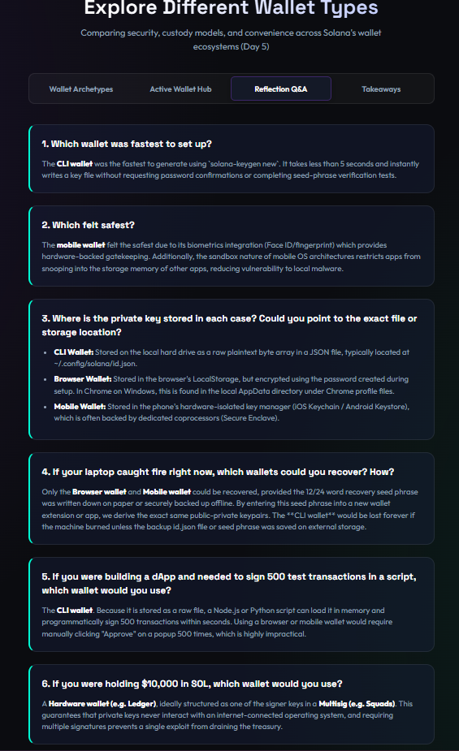
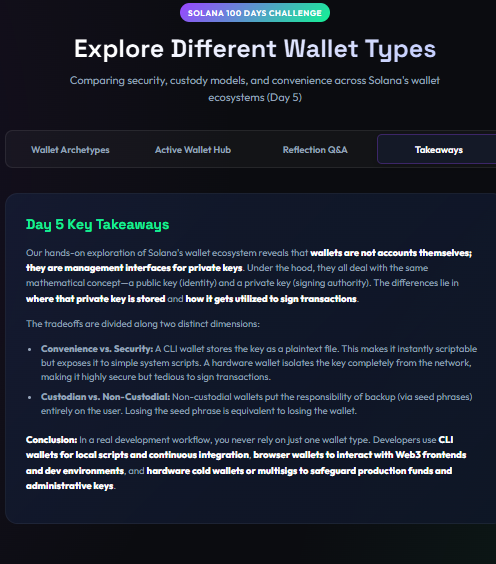

# Day 5: Explore Different Wallet Types

Today we analyzed and set up three different wallet types on Solana: CLI keypair wallet, Browser extension wallet, and Mobile app wallet, exploring their trade-offs along the axes of **Hot vs. Cold** and **Custodial vs. Non-custodial**.

---

## Interactive Dashboard Screenshots

We built and ran a local interactive **Solana Wallet Explorer & Reflection Hub** on localhost.

### 1. Wallet Archetypes Comparison Grid


### 2. Active Wallet Hub & Devnet RPC Balance Query


### 3. Reflection Q&A


### 4. Day 5 Key Takeaways


---

## Challenge Reflection Q&A

### 1. Which wallet was fastest to set up?
The **CLI wallet** was the fastest, requiring a single `solana-keygen new` command taking less than 5 seconds without seed phrase confirmation tests or password inputs.

### 2. Which felt safest?
The **Mobile wallet** felt safest because it utilizes hardware-isolated secure enclave chips, biometric authentication gates, and OS-level sandboxing.

### 3. Where is the private key stored in each case?
- **CLI Wallet:** Raw plaintext JSON array under `~/.config/solana/id.json`.
- **Browser Wallet:** Encrypted with setup password in browser's local sandbox storage directory.
- **Mobile Wallet:** Stored securely within iOS Keychain or Android Keystore backed by Secure Enclave.

### 4. If your laptop caught fire right now, which wallets could you recover? How?
- **Browser and Mobile Wallets:** Recoverable by importing their written-down 12/24-word recovery seed phrase on a new device.
- **CLI Wallet:** Permanent loss of funds/identity unless a physical backup of the JSON file or its seed phrase was created.

### 5. If you were building a dApp and needed to sign 500 test transactions in a script, which wallet would you use?
The **CLI wallet** because its plaintext private key file can be loaded directly into a Node/Python script memory to sign programmatically without requiring manual confirmation clicks.

### 6. If you were holding $10,000 in SOL, which wallet would you use?
A **Hardware wallet (Ledger)** or an multi-signature governance vault like **Squads Multisig** to completely decouple access from internet-facing environments.

---

## Running the Interactive Hub Locally

1. **Install dependencies:**
   ```bash
   npm install
   ```
2. **Run dev server:**
   ```bash
   npm run dev
   ```
   Open `http://localhost:5173/` in your browser.
