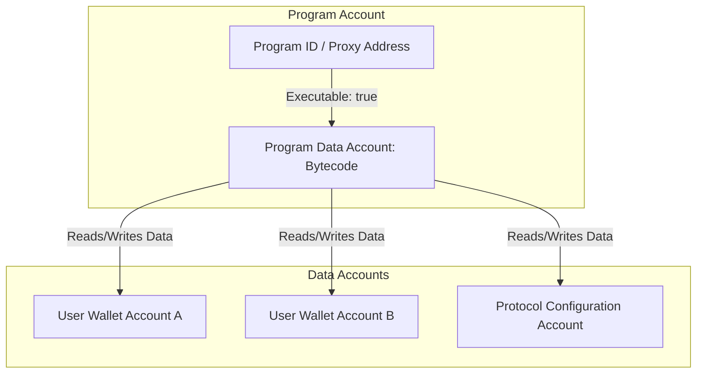

# Day 27: Writing About the Solana Account Model

Today, I took a step back from writing code to write about the core architectural foundation of Solana: **The Account Model**. To solidify my understanding, I wrote a comprehensive article aimed at Web2 developers who are new to blockchain, explaining how Solana manages state.

Below is the draft of the article, formatted for publishing on [DEV.to](https://dev.to).

---

# DEV.to Article Draft

**Title:** Demystifying the Solana Account Model: A Guide for Web2 Developers
**Tags:** `solana`, `blockchain`, `web3`, `beginners`

---

If you are a Web2 developer dipping your toes into the Web3 waters, blockchain architecture can feel incredibly alien. You hear terms like "smart contracts," "state," and "ledgers," and you try to map them to things you know. 

If you look at Ethereum, it might make sense at first: it uses an Account-based model where you have Externally Owned Accounts (EOAs, like your MetaMask wallet) and Contract Accounts (which contain both the code and the state/variables of a smart contract). This feels a bit like Object-Oriented Programming, where an object contains both its methods (code) and its properties (state).

But then you look at **Solana**, and everything you thought you understood gets flipped on its head. 

On Solana, **programs are completely stateless**, and **everything is an account**. 

Let's break down Solana’s Account Model using Web2 concepts you already use daily.

---

## The Ultimate Analogy: Solana as a Filesystem

The easiest way to understand Solana's account model is to think of the entire blockchain as a **global, decentralized filesystem**.

* **The Ledger is the Hard Drive:** A massive, shared storage space.
* **Accounts are Files:** Every piece of information on Solana lives inside an "account," which acts just like a file.
* **Public Keys are File Paths:** Every account has a unique 32-byte address (like `BPFLoaderUpgradeab1e11111111111111111111111` or a wallet address). Think of this public key as the absolute path to the file (e.g., `/users/alice/data.json`).
* **The System Program is the OS Kernel:** The underlying operating system kernel that manages file creation, allocating size, and assigning permissions.

Just like a file on your computer has metadata (file size, owner, read/write permissions) and file contents, a Solana account contains metadata and a raw byte array for data.

---

## The Anatomy of an Account: The 5 Fields

Every single account on Solana shares the exact same basic structure. When you query an account using the Solana command-line interface (`solana account <ADDRESS>`), the JSON response reveals five main fields:

```json
{
  "pubkey": "3zcpeKkCFg1z3sR1u1qQcm6h4n5t282a5cQ5bX2gYp3Z",
  "account": {
    "lamports": 124806720,
    "data": ["...", "base64"],
    "owner": "BPFLoaderUpgradeab1e11111111111111111111111",
    "executable": true,
    "rentEpoch": 18446744073709551615
  }
}
```

Let's unpack what these fields represent:

1. **`lamports` (The SOL Balance):** A lamport is the smallest fractional unit of SOL, named after Leslie Lamport (think of it like a Satoshi for Bitcoin or a Wei for Ethereum). `1 SOL = 1,000,000,000 lamports`. This balance is used to pay for storage and transaction fees.
2. **`data` (The File Contents):** A raw byte array (`Vec<u8>`) containing the actual state stored by this account. For a wallet account, this might be empty. For a database account, it contains serialized variables.
3. **`owner` (The File Owner/Permissions):** This is the public key of the program that controls this account. *Crucially, only the owner program is allowed to modify the account's data or deduct its lamport balance.*
4. **`executable` (Is it an App or a Document?):** A boolean flag. If `true`, this account contains compiled WebAssembly/SBF bytecode that the Solana runtime can run. It is a program (smart contract). If `false`, it's just a data storage account.
5. **`rent_epoch` (Storage Rent):** Historically used to track rent collections. Today, rent is deprecated because all accounts are required to be "rent-exempt" (more on this below). It is now set to a placeholder max value (`18446744073709551615`).

---

## Programs Don't Store State (Stateless Architecture)

In Web2, if you write a Node.js express server, the code is loaded into memory, and it might read/write from a local Postgres database. The server code itself doesn't dynamically change its own binary files on disk to save user data; it talks to an external database.

Solana works the exact same way. **Solana programs are stateless.**

On Ethereum, a smart contract's code and its variables are packed together in the same contract account. On Solana, they are strictly separated:



For example, the **Token-2022 Program** (`TokenzQdBNbXt8TuTRCEjrpb5764uWo1tz5SQH376BB`) contains the executable logic for minting and transferring tokens. But it doesn't store your token balance. Instead, your balance is stored in a separate **Token Account** owned by the Token-2022 program, which holds data indicating: *"This wallet address owns X amount of this token."*

---

## The Rules of Ownership: Solana's Security Model

How does Solana ensure someone doesn't just write a malicious script to change another user's balance? Through strict runtime ownership rules:

* **Only the Owner Program can write to the account data.**
* **Only the Owner Program can deduct lamports** (debit) from the account.
* **Anyone can credit lamports** to any writable account (just like anyone can transfer money to your bank account).
* **Anyone can read any account's data.** All accounts are public by default.

If Program A tries to modify an account owned by Program B, the Solana runtime rejects the transaction immediately. This simple rule eliminates a massive class of security vulnerabilities.

---

## Rent Exemption: Keeping the Ledger Lean

In Web2, if you rent an AWS EC2 instance or store files in an S3 bucket, you pay a recurring subscription. If you stop paying, AWS deletes your files.

Solana handles blockchain storage in a similar way. Because validators must keep all active accounts in memory (RAM) for fast transaction processing, storage isn't free. 

To prevent the blockchain from being filled with abandoned accounts, Solana requires accounts to maintain a minimum lamports balance. This is called being **Rent-Exempt**.

* The rent-exempt balance is directly proportional to the size of the account's `data` array.
* For a basic wallet account with zero data bytes, the rent-exempt minimum is roughly `0.00089 SOL`.
* When you close a Solana account, you can reclaim all the rent lamports back into your main wallet! It's like getting a deposit refund on a rental apartment.

---

## Summary

As a Web2 developer, you can master the Solana Account Model by keeping these four rules in mind:

1. **Everything is a file (account)** in a flat key-value store.
2. **Metadata is standardized** across all files (Lamports, Data, Owner, Executable).
3. **Programs are stateless executables**; they read and write to separate database files (data accounts).
4. **Ownership is absolute**; only the program marked as the `owner` can modify a file's contents or spend its funds.

Understanding this separation of code and state is the "aha!" moment for every Solana developer. Once you grasp this, building decentralized applications, understanding PDA (Program Derived Addresses) generation, and writing efficient Anchor programs starts to make perfect sense!

***

*Have questions about how accounts work on Solana? Drop a comment below, and let's discuss!*
