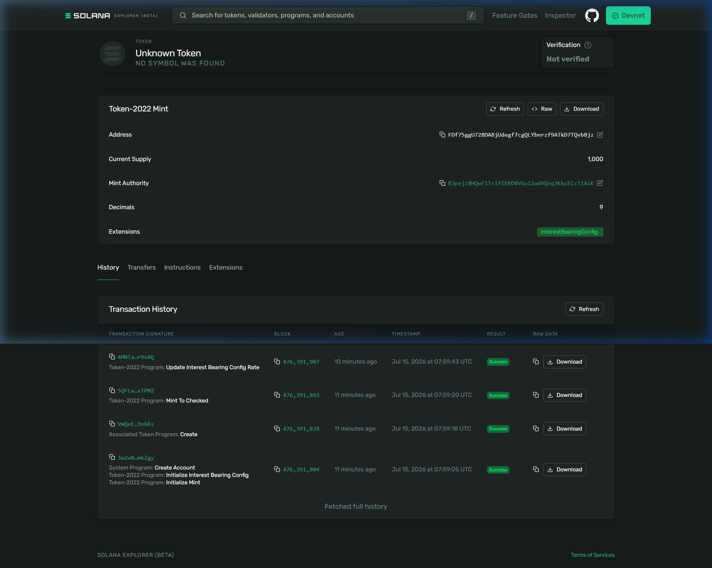

# Day 36: Create an Interest-Bearing Token on Solana

## 🧾 Proof of Execution (Devnet)

### 1. Devnet Configuration
```bash
$ solana config set --url devnet
Config File: C:\Users\athar\.config\solana\cli\config.yml
RPC URL: https://api.devnet.solana.com 
WebSocket URL: wss://api.devnet.solana.com/ (computed)
Keypair Path: C:\Users\athar\.config\solana\id.json 
Commitment: confirmed 
```

### 2. Creating and Minting the Token (Token-2022)
```bash
$ spl-token create-token --program-id TokenzQdBNbLqP5VEhdkAS6EPFLC1PHnBqCXEpPxuEb --interest-rate 500
Creating token FDf75ggU728DA8jUdegf7cgQLYbnrzf9ATkD7TQvbBjz under program TokenzQdBNbLqP5VEhdkAS6EPFLC1PHnBqCXEpPxuEb
Address:  FDf75ggU728DA8jUdegf7cgQLYbnrzf9ATkD7TQvbBjz
Decimals:  9

$ spl-token create-account FDf75ggU728DA8jUdegf7cgQLYbnrzf9ATkD7TQvbBjz --program-id TokenzQdBNbLqP5VEhdkAS6EPFLC1PHnBqCXEpPxuEb
Creating account FNoEAtVZXdotMWRV4ZBKJ6R1MyRtCZd2mejzRAA6JLNa

$ spl-token mint FDf75ggU728DA8jUdegf7cgQLYbnrzf9ATkD7TQvbBjz 1000 --program-id TokenzQdBNbLqP5VEhdkAS6EPFLC1PHnBqCXEpPxuEb
Minting 1000 tokens
  Token: FDf75ggU728DA8jUdegf7cgQLYbnrzf9ATkD7TQvbBjz
  Recipient: FNoEAtVZXdotMWRV4ZBKJ6R1MyRtCZd2mejzRAA6JLNa
```

### 3. Setting Interest Rate & Verifying Growth
```bash
$ spl-token set-interest-rate FDf75ggU728DA8jUdegf7cgQLYbnrzf9ATkD7TQvbBjz 15000
Setting Interest Rate for FDf75ggU728DA8jUdegf7cgQLYbnrzf9ATkD7TQvbBjz to 15000 bps

$ spl-token display FDf75ggU728DA8jUdegf7cgQLYbnrzf9ATkD7TQvbBjz --program-id TokenzQdBNbLqP5VEhdkAS6EPFLC1PHnBqCXEpPxuEb
SPL Token Mint
  Address: FDf75ggU728DA8jUdegf7cgQLYbnrzf9ATkD7TQvbBjz
  Program: TokenzQdBNbLqP5VEhdkAS6EPFLC1PHnBqCXEpPxuEb
  Supply: 1000000000000
  Decimals: 9
  Mint authority: BJpejz8HQwF1TciYZEBD8VGu12wdVQxq3KkcECcT1AiK
  Freeze authority: (not set)
Extensions
  Interest-bearing:
    Current rate: 15000bps
    Average rate: 500bps
    Rate authority: BJpejz8HQwF1TciYZEBD8VGu12wdVQxq3KkcECcT1AiK
```

### Solana Explorer Links (Devnet)
- **Mint Address**: [FDf75ggU728DA8jUdegf7cgQLYbnrzf9ATkD7TQvbBjz](https://explorer.solana.com/address/FDf75ggU728DA8jUdegf7cgQLYbnrzf9ATkD7TQvbBjz?cluster=devnet)

### 📸 Devnet Explorer Screenshot

