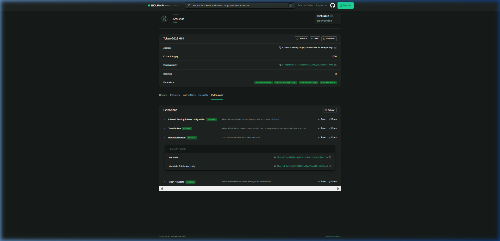

# Day 37: Build a Multi-Extension Token on Solana

## 🧾 Proof of Execution (Devnet)

### 1. Creating the Multi-Extension Mint
We created a single token mint with decimals set to `2`, a `1%` transfer fee (capped at 5 tokens max), `5%` interest-bearing rate, and enabled on-chain metadata:

```bash
$ spl-token --program-id TokenzQdBNbLqP5VEhdkAS6EPFLC1PHnBqCXEpPxuEb create-token --decimals 2 --transfer-fee-basis-points 100 --transfer-fee-maximum-fee 500 --interest-rate 5 --enable-metadata
Creating token 87Ge5UZSppdUVj1Wupq1EJGroHZneK2HLzdJmjwKttyX under program TokenzQdBNbLqP5VEhdkAS6EPFLC1PHnBqCXEpPxuEb

Address:  87Ge5UZSppdUVj1Wupq1EJGroHZneK2HLzdJmjwKttyX
Decimals:  2
```

### 2. Adding Metadata to the Mint
```bash
$ spl-token initialize-metadata 87Ge5UZSppdUVj1Wupq1EJGroHZneK2HLzdJmjwKttyX "ArcCoin" "ARC" "https://raw.githubusercontent.com/solana-developers/opos-asset/main/assets/CompressedCoil/metadata.json"
```

### 3. Displaying Mint Details
```bash
$ spl-token display 87Ge5UZSppdUVj1Wupq1EJGroHZneK2HLzdJmjwKttyX
SPL Token Mint
  Address: 87Ge5UZSppdUVj1Wupq1EJGroHZneK2HLzdJmjwKttyX
  Program: TokenzQdBNbLqP5VEhdkAS6EPFLC1PHnBqCXEpPxuEb
  Supply: 100000
  Decimals: 2
  Mint authority: BJpejz8HQwF1TciYZEBD8VGu12wdVQxq3KkcECcT1AiK
  Freeze authority: (not set)
Extensions
  Interest-bearing:
    Current rate: 5bps
    Average rate: 5bps
    Rate authority: BJpejz8HQwF1TciYZEBD8VGu12wdVQxq3KkcECcT1AiK
  Transfer fees:
    Current fee: 100bps
    Current maximum: 50000
    Config authority: BJpejz8HQwF1TciYZEBD8VGu12wdVQxq3KkcECcT1AiK
    Withdrawal authority: BJpejz8HQwF1TciYZEBD8VGu12wdVQxq3KkcECcT1AiK
    Withheld fees: 0
  Metadata Pointer:
    Authority: BJpejz8HQwF1TciYZEBD8VGu12wdVQxq3KkcECcT1AiK
    Metadata address: 87Ge5UZSppdUVj1Wupq1EJGroHZneK2HLzdJmjwKttyX
  Metadata:
    Update Authority: BJpejz8HQwF1TciYZEBD8VGu12wdVQxq3KkcECcT1AiK
    Mint: 87Ge5UZSppdUVj1Wupq1EJGroHZneK2HLzdJmjwKttyX
    Name: ArcCoin
    Symbol: ARC
    URI: https://raw.githubusercontent.com/solana-developers/opos-asset/main/assets/CompressedCoil/metadata.json
```

### 4. Creating Account & Minting
```bash
$ spl-token create-account 87Ge5UZSppdUVj1Wupq1EJGroHZneK2HLzdJmjwKttyX
Creating account A7oTxxVMxiTDmk6egirbZXDzibVoXRBDq6B4CvXLHfqP

$ spl-token mint 87Ge5UZSppdUVj1Wupq1EJGroHZneK2HLzdJmjwKttyX 1000
Minting 1000 tokens
  Token: 87Ge5UZSppdUVj1Wupq1EJGroHZneK2HLzdJmjwKttyX
  Recipient: A7oTxxVMxiTDmk6egirbZXDzibVoXRBDq6B4CvXLHfqP
```

### 5. Transferring & Withholding Fees
We generated a second wallet (`Gjd9Jo...`) and transferred 100 tokens. The transfer fee was successfully calculated and withheld:
```bash
$ spl-token transfer 87Ge5UZSppdUVj1Wupq1EJGroHZneK2HLzdJmjwKttyX 100 Gjd9JoMPHhAKYmBoMVd7rvHjPSkHC1Evn1uyncueVBLz --expected-fee 1 --allow-unfunded-recipient
Transfer 100 tokens
  Sender: A7oTxxVMxiTDmk6egirbZXDzibVoXRBDq6B4CvXLHfqP
  Recipient: Gjd9JoMPHhAKYmBoMVd7rvHjPSkHC1Evn1uyncueVBLz
  Recipient associated token account: DUq3oy9fDAq24PbbPSeiusnx5cXnAnfEhXUDgp197uJW

$ spl-token balance 87Ge5UZSppdUVj1Wupq1EJGroHZneK2HLzdJmjwKttyX
900

$ spl-token balance 87Ge5UZSppdUVj1Wupq1EJGroHZneK2HLzdJmjwKttyX --owner Gjd9JoMPHhAKYmBoMVd7rvHjPSkHC1Evn1uyncueVBLz
99
```

### 6. Harvesting the Withheld Fees
We successfully harvested the 1-token fee back into our original token account:
```bash
$ spl-token withdraw-withheld-tokens A7oTxxVMxiTDmk6egirbZXDzibVoXRBDq6B4CvXLHfqP DUq3oy9fDAq24PbbPSeiusnx5cXnAnfEhXUDgp197uJW

$ spl-token balance 87Ge5UZSppdUVj1Wupq1EJGroHZneK2HLzdJmjwKttyX
901
```

---

## 📸 Devnet Explorer Screenshot

Here is the proof of the multi-extension token `ArcCoin (ARC)` on the Solana Explorer showing all extensions initialized:



### Solana Explorer Links (Devnet)
- **Mint Address**: [87Ge5UZSppdUVj1Wupq1EJGroHZneK2HLzdJmjwKttyX](https://explorer.solana.com/address/87Ge5UZSppdUVj1Wupq1EJGroHZneK2HLzdJmjwKttyX?cluster=devnet)
