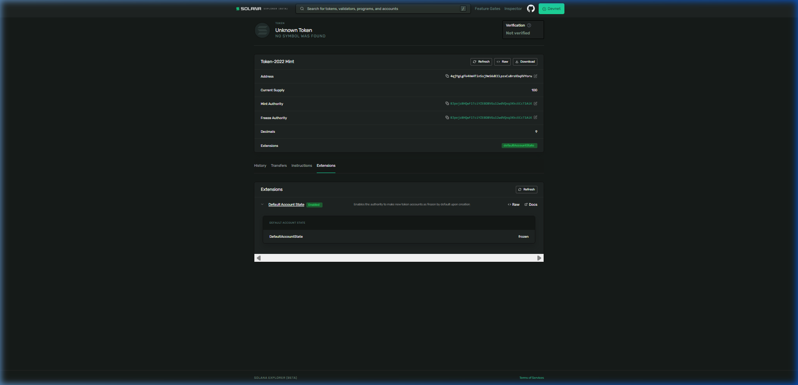

# Day 38: Create a Compliance-Gated Token with Default Frozen Accounts

## 🧾 Proof of Execution (Devnet)

### 1. Creating the Default Frozen Token Mint
We created a new mint with freeze capabilities and default account state set to `frozen`:
```bash
$ spl-token create-token --program-id TokenzQdBNbLqP5VEhdkAS6EPFLC1PHnBqCXEpPxuEb --enable-freeze --default-account-state frozen
Creating token 4qjYgLgFk4VmHTinSsj9mS6dCCLpzxCuBrzKbqXVYoru under program TokenzQdBNbLqP5VEhdkAS6EPFLC1PHnBqCXEpPxuEb

Address:  4qjYgLgFk4VmHTinSsj9mS6dCCLpzxCuBrzKbqXVYoru
Decimals:  9
```

### 2. Creating Two Token Accounts
We created two token accounts. The first belongs to our wallet and the second belongs to a new wallet `DYR7bX...`. Both start frozen by default:
```bash
# First Token Account
$ spl-token create-account 4qjYgLgFk4VmHTinSsj9mS6dCCLpzxCuBrzKbqXVYoru
Creating account BLPipRybZjDbt5JXh7FypMSri6XsasMLKCigQy3ijCWg

# Second Token Account
$ spl-token create-account 4qjYgLgFk4VmHTinSsj9mS6dCCLpzxCuBrzKbqXVYoru --owner DYR7bXDjutzJssgQQg2sAS1PpDVNYNYYWhdfQAVnScat --fee-payer C:\Users\athar\.config\solana\id.json
Creating account BYaFzPFaGozLHW4gxutwg6EkQnxSpatX6MNWQiAwVs9H
```

### 3. Attempting to Mint to a Frozen Account (FAIL)
As expected, attempting to mint to the frozen account triggers a `custom program error: 0x11` (Account is frozen):
```bash
$ spl-token mint 4qjYgLgFk4VmHTinSsj9mS6dCCLpzxCuBrzKbqXVYoru 100
Minting 100 tokens
  Token: 4qjYgLgFk4VmHTinSsj9mS6dCCLpzxCuBrzKbqXVYoru
  Recipient: BLPipRybZjDbt5JXh7FypMSri6XsasMLKCigQy3ijCWg
Error: Client(Error { request: Some(SendTransaction), kind: RpcError(RpcResponseError { code: -32002, message: "Transaction simulation failed: Error processing Instruction 0: custom program error: 0x11", data: SendTransactionPreflightFailure(RpcSimulateTransactionResult { err: Some(UiTransactionError(InstructionError(0, Custom(17)))), logs: Some(["Program TokenzQdBNbLqP5VEhdkAS6EPFLC1PHnBqCXEpPxuEb invoke [1]", "Program log: Instruction: MintToChecked", "Program log: Error: Account is frozen", "Program TokenzQdBNbLqP5VEhdkAS6EPFLC1PHnBqCXEpPxuEb failed: custom program error: 0x11"]) }) }) })
```

### 4. Thawing the First Account & Minting (SUCCESS)
We thawed the first account and successfully minted `100` tokens to it:
```bash
$ spl-token thaw BLPipRybZjDbt5JXh7FypMSri6XsasMLKCigQy3ijCWg
Thawing account: BLPipRybZjDbt5JXh7FypMSri6XsasMLKCigQy3ijCWg
  Token: 4qjYgLgFk4VmHTinSsj9mS6dCCLpzxCuBrzKbqXVYoru

$ spl-token mint 4qjYgLgFk4VmHTinSsj9mS6dCCLpzxCuBrzKbqXVYoru 100
Minting 100 tokens
  Token: 4qjYgLgFk4VmHTinSsj9mS6dCCLpzxCuBrzKbqXVYoru
  Recipient: BLPipRybZjDbt5JXh7FypMSri6XsasMLKCigQy3ijCWg
```

### 5. Attempting to Transfer to Still-Frozen Recipient (FAIL)
Even though the sender is thawed, the destination recipient is still frozen, so the transfer fails:
```bash
$ spl-token transfer 4qjYgLgFk4VmHTinSsj9mS6dCCLpzxCuBrzKbqXVYoru 50 DYR7bXDjutzJssgQQg2sAS1PpDVNYNYYWhdfQAVnScat --allow-unfunded-recipient
Transfer 50 tokens
  Sender: BLPipRybZjDbt5JXh7FypMSri6XsasMLKCigQy3ijCWg
  Recipient: DYR7bXDjutzJssgQQg2sAS1PpDVNYNYYWhdfQAVnScat
  Recipient associated token account: BYaFzPFaGozLHW4gxutwg6EkQnxSpatX6MNWQiAwVs9H
Error: Client(Error { request: Some(SendTransaction), kind: RpcError(RpcResponseError { code: -32002, message: "Transaction simulation failed: Error processing Instruction 0: custom program error: 0x11", data: SendTransactionPreflightFailure(RpcSimulateTransactionResult { err: Some(UiTransactionError(InstructionError(0, Custom(17)))), logs: Some(["Program TokenzQdBNbLqP5VEhdkAS6EPFLC1PHnBqCXEpPxuEb invoke [1]", "Program log: Instruction: TransferChecked", "Program log: Error: Account is frozen", "Program TokenzQdBNbLqP5VEhdkAS6EPFLC1PHnBqCXEpPxuEb failed: custom program error: 0x11"]) }) }) })
```

### 6. Thawing the Recipient & Transferring (SUCCESS)
We thawed the second account (`BYaFzP...`) and successfully executed the `50` token transfer:
```bash
$ spl-token thaw BYaFzPFaGozLHW4gxutwg6EkQnxSpatX6MNWQiAwVs9H
Thawing account: BYaFzPFaGozLHW4gxutwg6EkQnxSpatX6MNWQiAwVs9H
  Token: 4qjYgLgFk4VmHTinSsj9mS6dCCLpzxCuBrzKbqXVYoru

$ spl-token transfer 4qjYgLgFk4VmHTinSsj9mS6dCCLpzxCuBrzKbqXVYoru 50 DYR7bXDjutzJssgQQg2sAS1PpDVNYNYYWhdfQAVnScat --allow-unfunded-recipient
Transfer 50 tokens
  Sender: BLPipRybZjDbt5JXh7FypMSri6XsasMLKCigQy3ijCWg
  Recipient: DYR7bXDjutzJssgQQg2sAS1PpDVNYNYYWhdfQAVnScat
  Recipient associated token account: BYaFzPFaGozLHW4gxutwg6EkQnxSpatX6MNWQiAwVs9H

$ spl-token accounts --owner DYR7bXDjutzJssgQQg2sAS1PpDVNYNYYWhdfQAVnScat
Token                                         Balance
-----------------------------------------------------
4qjYgLgFk4VmHTinSsj9mS6dCCLpzxCuBrzKbqXVYoru  50
```

---

## 📸 Devnet Explorer Screenshot

Here is the proof of the compliance-gated token on the Solana Explorer showing the `Default Account State` configured as `Frozen`:



### Solana Explorer Links (Devnet)
- **Mint Address**: [4qjYgLgFk4VmHTinSsj9mS6dCCLpzxCuBrzKbqXVYoru](https://explorer.solana.com/address/4qjYgLgFk4VmHTinSsj9mS6dCCLpzxCuBrzKbqXVYoru?cluster=devnet)
