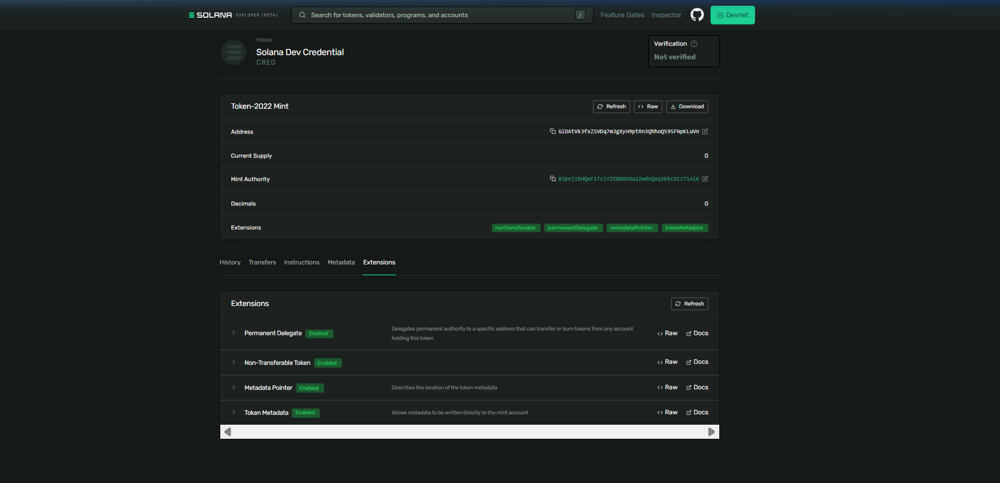

# Day 40: Design a Revocable Credential Token with Non-Transferable and Permanent Delegate Extensions

## 🧾 Proof of Execution (Devnet)

### 1. Creating the Revocable Credential Token Mint
We created a new mint with decimals set to `0` (credentials are whole units), and enabled the **Non-Transferable**, **Permanent Delegate**, and **Metadata** extensions:
```bash
$ spl-token --program-id TokenzQdBNbLqP5VEhdkAS6EPFLC1PHnBqCXEpPxuEb create-token --decimals 0 --enable-non-transferable --enable-permanent-delegate --enable-metadata
Creating token GiDAtVk3fxZSVDq7mJgXyH9ptRn3QhhoQ59SFNpKLuVn under program TokenzQdBNbLqP5VEhdkAS6EPFLC1PHnBqCXEpPxuEb

Address:  GiDAtVk3fxZSVDq7mJgXyH9ptRn3QhhoQ59SFNpKLuVn
Decimals:  0
```

### 2. Initializing Metadata
```bash
$ spl-token initialize-metadata GiDAtVk3fxZSVDq7mJgXyH9ptRn3QhhoQ59SFNpKLuVn "Solana Dev Credential" "CRED" "https://example.com/credential.json"
```

### 3. Minting the Credential to a Recipient
We created a recipient wallet (`5vWSMU...`), opened a token account for it, and minted `1` credential token:
```bash
$ spl-token create-account GiDAtVk3fxZSVDq7mJgXyH9ptRn3QhhoQ59SFNpKLuVn --owner 5vWSMU8RLzWZc37GUzyxEswE8A5JZxysrjxEhh7c9W5H --fee-payer C:\Users\athar\.config\solana\id.json --program-id TokenzQdBNbLqP5VEhdkAS6EPFLC1PHnBqCXEpPxuEb
Creating account FZR4PUoWhmTBYAgfwxKXgMvxJLPziGaSnrbbrJqT5U1e

$ spl-token mint GiDAtVk3fxZSVDq7mJgXyH9ptRn3QhhoQ59SFNpKLuVn 1 --recipient-owner 5vWSMU8RLzWZc37GUzyxEswE8A5JZxysrjxEhh7c9W5H --program-id TokenzQdBNbLqP5VEhdkAS6EPFLC1PHnBqCXEpPxuEb
Minting 1 tokens
  Token: GiDAtVk3fxZSVDq7mJgXyH9ptRn3QhhoQ59SFNpKLuVn
  Recipient: FZR4PUoWhmTBYAgfwxKXgMvxJLPziGaSnrbbrJqT5U1e
```

### 4. Verifying Token Cannot Be Transferred (FAIL)
Attempting to transfer the credential token to a third party wallet (`4SyUvc...`) fails as expected because the token is soulbound (non-transferable):
```bash
$ spl-token transfer GiDAtVk3fxZSVDq7mJgXyH9ptRn3QhhoQ59SFNpKLuVn 1 4SyUvcopepvjYmL7sXspFrFM6vo3Bfx9dcQZ9JYBYpSH --owner .\recipient-wallet.json --fee-payer C:\Users\athar\.config\solana\id.json --program-id TokenzQdBNbLqP5VEhdkAS6EPFLC1PHnBqCXEpPxuEb --fund-recipient --allow-unfunded-recipient
Transfer 1 tokens
  Sender: FZR4PUoWhmTBYAgfwxKXgMvxJLPziGaSnrbbrJqT5U1e
  Recipient: 4SyUvcopepvjYmL7sXspFrFM6vo3Bfx9dcQZ9JYBYpSH
  Recipient associated token account: 66zhEcPMoKaFhPba9mkynKREhWdYyM3ZGFwHkk93Jz2F
Error: Client(Error { request: Some(SendTransaction), kind: RpcError(RpcResponseError { code: -32002, message: "Transaction simulation failed: Error processing Instruction 1: custom program error: 0x25", data: SendTransactionPreflightFailure(RpcSimulateTransactionResult { err: Some(UiTransactionError(InstructionError(1, Custom(37)))), logs: Some([
  ...,
  "Program log: Instruction: TransferChecked",
  "Program log: Transfer is disabled for this mint",
  "Program TokenzQdBNbLqP5VEhdkAS6EPFLC1PHnBqCXEpPxuEb failed: custom program error: 0x25"
]) }) }) })
```

### 5. Revoking the Credential using the Permanent Delegate (SUCCESS)
Since our keypair is the Permanent Delegate, we are able to burn the credential token from the recipient's account without requiring their signature:
```bash
$ spl-token burn FZR4PUoWhmTBYAgfwxKXgMvxJLPziGaSnrbbrJqT5U1e 1 --owner C:\Users\athar\.config\solana\id.json --program-id TokenzQdBNbLqP5VEhdkAS6EPFLC1PHnBqCXEpPxuEb
Burn 1 tokens
  Source: FZR4PUoWhmTBYAgfwxKXgMvxJLPziGaSnrbbrJqT5U1e

$ spl-token balance GiDAtVk3fxZSVDq7mJgXyH9ptRn3QhhoQ59SFNpKLuVn --owner 5vWSMU8RLzWZc37GUzyxEswE8A5JZxysrjxEhh7c9W5H --program-id TokenzQdBNbLqP5VEhdkAS6EPFLC1PHnBqCXEpPxuEb
0
```

### 6. Inspecting the Mint Configuration
```bash
$ spl-token display GiDAtVk3fxZSVDq7mJgXyH9ptRn3QhhoQ59SFNpKLuVn --program-id TokenzQdBNbLqP5VEhdkAS6EPFLC1PHnBqCXEpPxuEb
SPL Token Mint
  Address: GiDAtVk3fxZSVDq7mJgXyH9ptRn3QhhoQ59SFNpKLuVn
  Program: TokenzQdBNbLqP5VEhdkAS6EPFLC1PHnBqCXEpPxuEb
  Supply: 0
  Decimals: 0
  Mint authority: BJpejz8HQwF1TciYZEBD8VGu12wdVQxq3KkcECcT1AiK
  Freeze authority: (not set)
Extensions
  Permanent delegate: BJpejz8HQwF1TciYZEBD8VGu12wdVQxq3KkcECcT1AiK
  Non-transferable
  Metadata Pointer:
    Authority: BJpejz8HQwF1TciYZEBD8VGu12wdVQxq3KkcECcT1AiK
    Metadata address: GiDAtVk3fxZSVDq7mJgXyH9ptRn3QhhoQ59SFNpKLuVn
  Metadata:
    Update Authority: BJpejz8HQwF1TciYZEBD8VGu12wdVQxq3KkcECcT1AiK
    Mint: GiDAtVk3fxZSVDq7mJgXyH9ptRn3QhhoQ59SFNpKLuVn
    Name: Solana Dev Credential
    Symbol: CRED
    URI: https://example.com/credential.json
```

---

## 📸 Devnet Explorer Screenshot

Here is the proof of the revocable credential token on the Solana Explorer showing all extensions (`permanentDelegate`, `nonTransferable`, `metadataPointer`, and `tokenMetadata`):



### Solana Explorer Links (Devnet)
- **Mint Address**: [GiDAtVk3fxZSVDq7mJgXyH9ptRn3QhhoQ59SFNpKLuVn](https://explorer.solana.com/address/GiDAtVk3fxZSVDq7mJgXyH9ptRn3QhhoQ59SFNpKLuVn?cluster=devnet)
