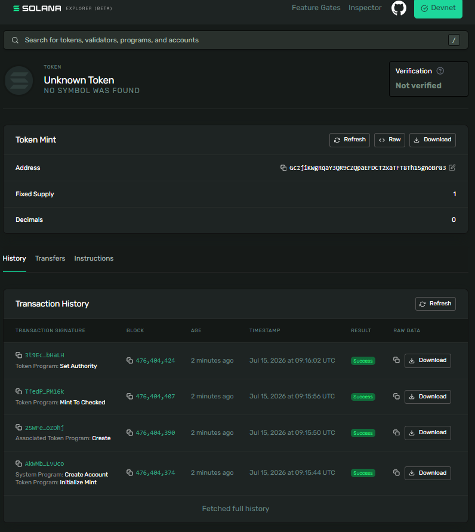

# Day 43: Mint a 1-of-1 SPL Token and Meet Your First NFT 🎨

Today, I created a brand new token mint on Solana Devnet configured to be a true **Non-Fungible Token (NFT)**:
- **Zero Decimals**: Ensuring it cannot be subdivided.
- **Supply of 1**: Minted exactly one token to my wallet.
- **Disabled Mint Authority**: Revoked the ability to mint any future supply, sealing it at exactly 1 of 1 forever.

---

## 🛠️ CLI Execution Steps & Outputs

### 1. Confirm Network & Balance
```bash
$ solana config set --url https://api.devnet.solana.com
Config File: C:\Users\athar\.config\solana\cli\config.yml
RPC URL: https://api.devnet.solana.com 
WebSocket URL: wss://api.devnet.solana.com/ (computed)
Keypair Path: C:\Users\athar\.config\solana\id.json 
Commitment: confirmed 

$ solana balance
0.35879532 SOL
```

### 2. Create the Token Mint (0 Decimals)
```bash
$ spl-token create-token --decimals 0
Creating token GczjiKWgRqaY3QR9cZQpaEFDCT2xaTFT8Th15gnoBr83 under program TokenkegQfeZyiNwAJbNbGKPFXCWuBvf9Ss623VQ5DA

Address:  GczjiKWgRqaY3QR9cZQpaEFDCT2xaTFT8Th15gnoBr83
Decimals:  0

Signature: AkWMbqfx9471XULaE9D7acRnau2K6moB33aLdsodXATGWc8HusgpyQdnkCufRsiyRmDZ4fodeLjrcdZFTNLvUco
```

### 3. Create Associated Token Account
```bash
$ spl-token create-account GczjiKWgRqaY3QR9cZQpaEFDCT2xaTFT8Th15gnoBr83
Creating account Axx6hM8k1joYg9kgJoWKdy7LSc5vj2LkEYRFkhw65qRq

Signature: 25WFe5pW4dZ6dMcSDWUUAuyjKFUV8DJYHDL8d8479ENq7YJ8neXsvDPN59b2ZFL3KtFxcpRNTkV95VV5dMBoZDhj
```

### 4. Mint Exactly One Token
```bash
$ spl-token mint GczjiKWgRqaY3QR9cZQpaEFDCT2xaTFT8Th15gnoBr83 1
Minting 1 tokens
  Token: GczjiKWgRqaY3QR9cZQpaEFDCT2xaTFT8Th15gnoBr83
  Recipient: Axx6hM8k1joYg9kgJoWKdy7LSc5vj2LkEYRFkhw65qRq

Signature: TfedPvM1meFjCwiKVntsFEgmgPWzyevmPwUexz67wWV8WECt9n27Uj8suUX8m7LSmWGpSKwTgGF8xfauJZPM16k
```

### 5. Disable Mint Authority Permanently
```bash
$ spl-token authorize GczjiKWgRqaY3QR9cZQpaEFDCT2xaTFT8Th15gnoBr83 mint --disable
Updating GczjiKWgRqaY3QR9cZQpaEFDCT2xaTFT8Th15gnoBr83
  Current mint: BJpejz8HQwF1TciYZEBD8VGu12wdVQxq3KkcECcT1AiK
  New mint: disabled

Signature: 3t9EciqLQn1HP4KphecXC9gRF4Ehz6FgTKCmYAUZzGvotUxahk7a75PeYnT2EULhTEdQmYiqvjFz4gmStF8bHaLH
```

### 6. Verify Token Supply
```bash
$ spl-token supply GczjiKWgRqaY3QR9cZQpaEFDCT2xaTFT8Th15gnoBr83
1
```

---

## 🔗 Explorer Link
- **Solana Explorer (Devnet)**: [GczjiKWgRqaY3QR9cZQpaEFDCT2xaTFT8Th15gnoBr83](https://explorer.solana.com/address/GczjiKWgRqaY3QR9cZQpaEFDCT2xaTFT8Th15gnoBr83?cluster=devnet)

---

## 🖼️ Explorer Screenshot


