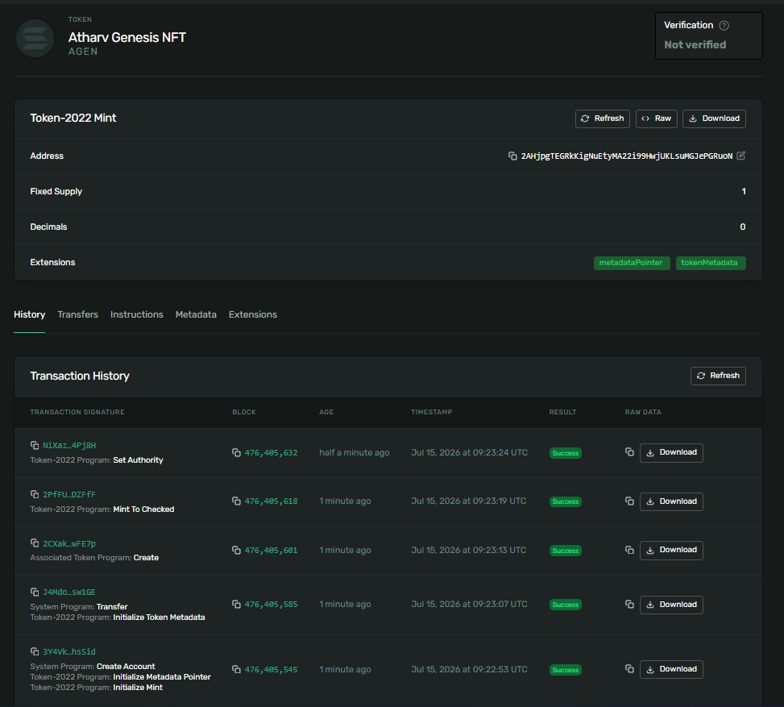

# Day 44: Give Your NFT a Name, an Image, and On-Chain Metadata 🎨

Today, I upgraded the 1-of-1 token concept by attaching on-chain metadata directly to the mint account using the **SPL Token Metadata Extension** (Token-2022). 

Instead of showing up as an "Unknown Token", explorers and wallets can now resolve the name, symbol, description, traits, and image!

---

## 🏗️ Architecture Flow
```
               Wallet
                  │
          NFT Mint Account
                  │
        ┌─────────┴─────────┐
        │                   │
Metadata Pointer      Token Metadata
        │                   │
        │
        ▼
Metadata URI (GitHub Raw)
        │
        ▼
metadata.json (On GitHub)
        │
        ▼
Image & Attributes
```

---

## 🛠️ CLI Execution Steps & Outputs

### 1. Host Metadata JSON
Created [metadata.json](file:///c:/Users/athar/OneDrive/Desktop/100D_Solana/D1/100-days-of-solana/day-44/metadata.json) locally, committed, and pushed to GitHub to get a raw, public URI:
`https://raw.githubusercontent.com/atharv20s/100daysofsolana/main/day-44/metadata.json`

### 2. Create the Token-2022 Mint with Metadata Extension Enabled
```bash
$ spl-token create-token --program-id TokenzQdBNbLqP5VEhdkAS6EPFLC1PHnBqCXEpPxuEb --enable-metadata --decimals 0
Creating token 2AHjpgTEGRkKigNuEtyMA22i99HwjUKLsuMGJePGRuoN under program TokenzQdBNbLqP5VEhdkAS6EPFLC1PHnBqCXEpPxuEb
To initialize metadata inside the mint, please run `spl-token initialize-metadata 2AHjpgTEGRkKigNuEtyMA22i99HwjUKLsuMGJePGRuoN <YOUR_TOKEN_NAME> <YOUR_TOKEN_SYMBOL> <YOUR_TOKEN_URI>`, and sign with the mint authority.

Address:  2AHjpgTEGRkKigNuEtyMA22i99HwjUKLsuMGJePGRuoN
Decimals:  0
```

### 3. Initialize On-Chain Metadata Fields
```bash
$ spl-token initialize-metadata 2AHjpgTEGRkKigNuEtyMA22i99HwjUKLsuMGJePGRuoN "Atharv Genesis NFT" "AGEN" "https://raw.githubusercontent.com/atharv20s/100daysofsolana/main/day-44/metadata.json"
Signature: J4Mdo6LwCsyr82euBAmibomANSHFNHWsnR44UQtoMQtkpZuvV8KswtFXn7xG9vawUe4773SdNDLHy3k263sw1GE
```

### 4. Create Token Account & Mint 1 Unit
```bash
$ spl-token create-account 2AHjpgTEGRkKigNuEtyMA22i99HwjUKLsuMGJePGRuoN
Creating account 9e5VrCCvr62sEDdBUkcUKJ4qQEzrVerwBwBT8Y5iqDM2

$ spl-token mint 2AHjpgTEGRkKigNuEtyMA22i99HwjUKLsuMGJePGRuoN 1
Minting 1 tokens
  Token: 2AHjpgTEGRkKigNuEtyMA22i99HwjUKLsuMGJePGRuoN
  Recipient: 9e5VrCCvr62sEDdBUkcUKJ4qQEzrVerwBwBT8Y5iqDM2
```

### 5. Disable Mint Authority
```bash
$ spl-token authorize 2AHjpgTEGRkKigNuEtyMA22i99HwjUKLsuMGJePGRuoN mint --disable
Updating 2AHjpgTEGRkKigNuEtyMA22i99HwjUKLsuMGJePGRuoN
  Current mint: BJpejz8HQwF1TciYZEBD8VGu12wdVQxq3KkcECcT1AiK
  New mint: disabled
```

### 6. Verify Configuration
```bash
$ spl-token display 2AHjpgTEGRkKigNuEtyMA22i99HwjUKLsuMGJePGRuoN

SPL Token Mint
  Address: 2AHjpgTEGRkKigNuEtyMA22i99HwjUKLsuMGJePGRuoN
  Program: TokenzQdBNbLqP5VEhdkAS6EPFLC1PHnBqCXEpPxuEb
  Supply: 1
  Decimals: 0
  Mint authority: (not set)
  Freeze authority: (not set)
Extensions
  Metadata Pointer:
    Authority: BJpejz8HQwF1TciYZEBD8VGu12wdVQxq3KkcECcT1AiK
    Metadata address: 2AHjpgTEGRkKigNuEtyMA22i99HwjUKLsuMGJePGRuoN
  Metadata:
    Update Authority: BJpejz8HQwF1TciYZEBD8VGu12wdVQxq3KkcECcT1AiK
    Mint: 2AHjpgTEGRkKigNuEtyMA22i99HwjUKLsuMGJePGRuoN
    Name: Atharv Genesis NFT
    Symbol: AGEN
    URI: https://raw.githubusercontent.com/atharv20s/100daysofsolana/main/day-44/metadata.json
```

---

## 🔗 Verification Links
- **Solana Explorer (Devnet)**: [2AHjpgTEGRkKigNuEtyMA22i99HwjUKLsuMGJePGRuoN](https://explorer.solana.com/address/2AHjpgTEGRkKigNuEtyMA22i99HwjUKLsuMGJePGRuoN?cluster=devnet)
- **Hosted JSON Metadata**: [metadata.json](https://raw.githubusercontent.com/atharv20s/100daysofsolana/main/day-44/metadata.json)

---

## 🖼️ Explorer Screenshot


