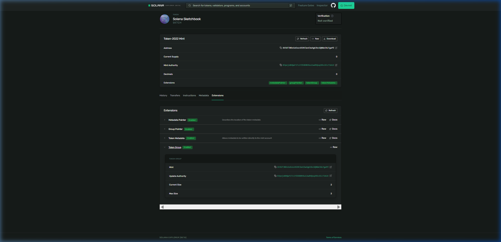

# Day 45: Group your NFTs into an on-chain collection 🏷️

Today, I built a real Token Extensions NFT collection on-chain by creating one group mint, minting two member NFTs, and linking them on-chain using the **SPL Token Group and Member Extensions** (Token-2022).

On older Solana stacks, this linkage was managed off-program via Metaplex Token Metadata. With Token-2022, we express the relationship natively at the program level:
*   The **Group Extension** marks one mint as the collection itself.
*   The **Member Extension** marks other individual mints as belonging to that collection.

---

## 🏗️ Architecture Flow
```
                     ┌──────────────────┐
                     │  Collection Mint │ (Group Extension)
                     │ (Solana Sketchbook)
                     │   Max Size: 3    │
                     └────────┬─────────┘
                              │
               ┌──────────────┴──────────────┐
               ▼                             ▼
      ┌─────────────────┐           ┌─────────────────┐
      │  Member 1 Mint  │           │  Member 2 Mint  │
      │   (Sketch #1)   │           │   (Sketch #2)   │ (Member Extension)
      │  Member No: 1   │           │  Member No: 2   │
      └─────────────────┘           └─────────────────┘
```

---

## 🛠️ CLI Execution Steps & Outputs

### 1. Create the Collection (Group) Mint
```bash
$ spl-token --program-id TokenzQdBNbLqP5VEhdkAS6EPFLC1PHnBqCXEpPxuEb create-token --decimals 0 --enable-metadata --enable-group
Creating token 6V3UTJ8DsSeEesnXS9KJanCbwVg63bcUQNGmJALFgaPZ under program TokenzQdBNbLqP5VEhdkAS6EPFLC1PHnBqCXEpPxuEb

Address:  6V3UTJ8DsSeEesnXS9KJanCbwVg63bcUQNGmJALFgaPZ
Decimals:  0
```

### 2. Stamp Collection Metadata & Initialize the Group
```bash
# Initialize metadata fields
$ spl-token initialize-metadata 6V3UTJ8DsSeEesnXS9KJanCbwVg63bcUQNGmJALFgaPZ "Solana Sketchbook" "SKTCH" "https://gist.githubusercontent.com/janvinsha/b477ebe4dda46b0ef03895c4ea930a46/raw/f29222bcaff0d4979fe7ebb610a00bb97a8418ec/collection.json"

# Initialize group size to max size 3
$ spl-token initialize-group 6V3UTJ8DsSeEesnXS9KJanCbwVg63bcUQNGmJALFgaPZ 3
```

### 3. Mint Member 1 ("Sketch #1") and Link
```bash
# Create member mint
$ spl-token --program-id TokenzQdBNbLqP5VEhdkAS6EPFLC1PHnBqCXEpPxuEb create-token --decimals 0 --enable-metadata --enable-member
Address:  BoMVJqscNrmML6drZppJHYmPMcqdyKZ2YXw5mWLDoS3s

# Stamp with metadata
$ spl-token initialize-metadata BoMVJqscNrmML6drZppJHYmPMcqdyKZ2YXw5mWLDoS3s "Sketch #1" "SK1" "https://gist.githubusercontent.com/janvinsha/3412c5d4e92b6de9a2ed82337ecafc44/raw/99359fc62ffd0480b6a52ee1ad4048ecba4ae61c/nft.json"

# Link to collection
$ spl-token initialize-member BoMVJqscNrmML6drZppJHYmPMcqdyKZ2YXw5mWLDoS3s 6V3UTJ8DsSeEesnXS9KJanCbwVg63bcUQNGmJALFgaPZ

# Create account, mint exactly 1 unit, and disable further minting (lock supply)
$ spl-token create-account BoMVJqscNrmML6drZppJHYmPMcqdyKZ2YXw5mWLDoS3s
$ spl-token mint BoMVJqscNrmML6drZppJHYmPMcqdyKZ2YXw5mWLDoS3s 1
$ spl-token authorize BoMVJqscNrmML6drZppJHYmPMcqdyKZ2YXw5mWLDoS3s mint --disable
```

### 4. Mint Member 2 ("Sketch #2") and Link
```bash
# Create member mint
$ spl-token --program-id TokenzQdBNbLqP5VEhdkAS6EPFLC1PHnBqCXEpPxuEb create-token --decimals 0 --enable-metadata --enable-member
Address:  5xFH2Q26oND9MufCW5qckWUz23mBLXS25jXdWcKoq1HE

# Stamp with metadata
$ spl-token initialize-metadata 5xFH2Q26oND9MufCW5qckWUz23mBLXS25jXdWcKoq1HE "Sketch #2" "SK2" "https://gist.githubusercontent.com/janvinsha/3412c5d4e92b6de9a2ed82337ecafc44/raw/99359fc62ffd0480b6a52ee1ad4048ecba4ae61c/nft.json"

# Link to collection
$ spl-token initialize-member 5xFH2Q26oND9MufCW5qckWUz23mBLXS25jXdWcKoq1HE 6V3UTJ8DsSeEesnXS9KJanCbwVg63bcUQNGmJALFgaPZ

# Create account, mint exactly 1 unit, and disable further minting (lock supply)
$ spl-token create-account 5xFH2Q26oND9MufCW5qckWUz23mBLXS25jXdWcKoq1HE
$ spl-token mint 5xFH2Q26oND9MufCW5qckWUz23mBLXS25jXdWcKoq1HE 1
$ spl-token authorize 5xFH2Q26oND9MufCW5qckWUz23mBLXS25jXdWcKoq1HE mint --disable
```

---

## 🔍 On-Chain Extensions Verification
Running `spl-token display` shows the relationship is baked directly into the mint bytes:

### Collection Mint Extensions (Token Group):
```yaml
Extensions
  Metadata Pointer:
    Authority: BJpejz8HQwF1TciYZEBD8VGu12wdVQxq3KkcECcT1AiK
    Metadata address: 6V3UTJ8DsSeEesnXS9KJanCbwVg63bcUQNGmJALFgaPZ
  Group Pointer:
    Authority: BJpejz8HQwF1TciYZEBD8VGu12wdVQxq3KkcECcT1AiK
    Group address: 6V3UTJ8DsSeEesnXS9KJanCbwVg63bcUQNGmJALFgaPZ
  Token Group:
    Update Authority: BJpejz8HQwF1TciYZEBD8VGu12wdVQxq3KkcECcT1AiK
    Mint: 6V3UTJ8DsSeEesnXS9KJanCbwVg63bcUQNGmJALFgaPZ
    Size: 2
    Max Size: 3
```

### Member Mint Extensions (Token Group Member):
```yaml
Extensions
  Metadata Pointer:
    Authority: BJpejz8HQwF1TciYZEBD8VGu12wdVQxq3KkcECcT1AiK
    Metadata address: BoMVJqscNrmML6drZppJHYmPMcqdyKZ2YXw5mWLDoS3s
  Group Member Pointer:
    Authority: BJpejz8HQwF1TciYZEBD8VGu12wdVQxq3KkcECcT1AiK
    Member address: BoMVJqscNrmML6drZppJHYmPMcqdyKZ2YXw5mWLDoS3s
  Token Group Member:
    Mint: BoMVJqscNrmML6drZppJHYmPMcqdyKZ2YXw5mWLDoS3s
    Group: 6V3UTJ8DsSeEesnXS9KJanCbwVg63bcUQNGmJALFgaPZ
    Member Number: 1
```

---

## 🔗 Verification Links
*   **Collection Mint (Group):** [`6V3UTJ8DsSeEesnXS9KJanCbwVg63bcUQNGmJALFgaPZ`](https://explorer.solana.com/address/6V3UTJ8DsSeEesnXS9KJanCbwVg63bcUQNGmJALFgaPZ?cluster=devnet)
*   **Member 1 Mint (Sketch #1):** [`BoMVJqscNrmML6drZppJHYmPMcqdyKZ2YXw5mWLDoS3s`](https://explorer.solana.com/address/BoMVJqscNrmML6drZppJHYmPMcqdyKZ2YXw5mWLDoS3s?cluster=devnet)
*   **Member 2 Mint (Sketch #2):** [`5xFH2Q26oND9MufCW5qckWUz23mBLXS25jXdWcKoq1HE`](https://explorer.solana.com/address/5xFH2Q26oND9MufCW5qckWUz23mBLXS25jXdWcKoq1HE?cluster=devnet)

---

## 🖼️ Explorer Screenshot
Below is the screenshot showing the Collection Mint on Solana Explorer Devnet with the expanded Group panel indicating a size of `2` and max size of `3`:


