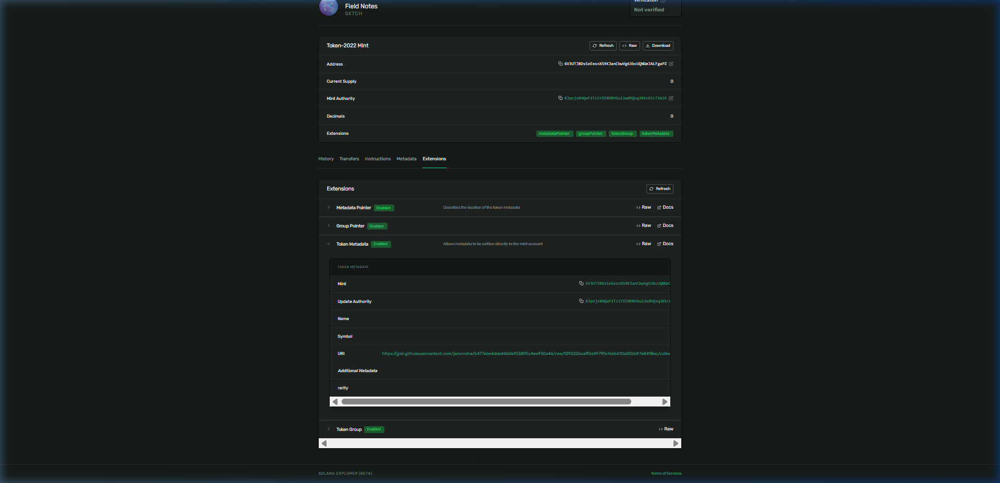

# Day 47: Mutate your NFT's metadata live on devnet 🧬

Today, I mutated my NFT Collection's metadata live on the Solana Devnet using Token-2022 program-level metadata instructions.

Instead of treating on-chain states as static records, this challenge demonstrates how metadata exists as a mutable row inside the mint account, updating instantaneously across the network.

---

## 🛠️ Mutations Performed on Collection Mint (`6V3UTJ8DsSeEesnXS9KJanCbwVg63bcUQNGmJALFgaPZ`)

### 1. Rename the Mint
Changed the collection display name from `"Solana Sketchbook"` to `"Field Notes"`:
```bash
$ spl-token update-metadata 6V3UTJ8DsSeEesnXS9KJanCbwVg63bcUQNGmJALFgaPZ name "Field Notes"
Signature: 3abi4mQE9tgVhWSRLrpEgwqys2ppr6i8btNScKds9ADCpvJotdUt8TL3d9WmPCEpX83PrAzrPUKCkYW6cP8tRfiS
```

### 2. Add Custom Metadata Field
Appended a custom key-value pair (`rarity: legendary`) to the `additional_metadata` array:
```bash
$ spl-token update-metadata 6V3UTJ8DsSeEesnXS9KJanCbwVg63bcUQNGmJALFgaPZ rarity legendary
Signature: 3sW1GrPmVLu77woxNGKg9GNSqSokqsJhWfiSFHaMnGdxpbxoPJgDtfeLUSraCAwdA7nVK1pVTxuCUUPd5VCPo4Aa
```

---

## 🔍 On-Chain Extensions Verification
Running `spl-token display 6V3UTJ8DsSeEesnXS9KJanCbwVg63bcUQNGmJALFgaPZ` confirms both updates succeeded on-chain:
```yaml
Extensions
  Metadata:
    Update Authority: BJpejz8HQwF1TciYZEBD8VGu12wdVQxq3KkcECcT1AiK
    Mint: 6V3UTJ8DsSeEesnXS9KJanCbwVg63bcUQNGmJALFgaPZ
    Name: Field Notes
    Symbol: SKTCH
    URI: https://gist.githubusercontent.com/janvinsha/b477ebe4dda46b0ef03895c4ea930a46/raw/f29222bcaff0d4979fe7ebb610a00bb97a8418ec/collection.json
    rarity: legendary
```

---

## 🔗 Verification Links
*   **Collection Mint (Group):** [`6V3UTJ8DsSeEesnXS9KJanCbwVg63bcUQNGmJALFgaPZ`](https://explorer.solana.com/address/6V3UTJ8DsSeEesnXS9KJanCbwVg63bcUQNGmJALFgaPZ?cluster=devnet)

---

## 🖼️ Explorer Screenshot
Below is the screenshot from Solana Explorer Devnet showing the updated metadata name (`Field Notes`) and the custom field (`rarity: legendary`):


