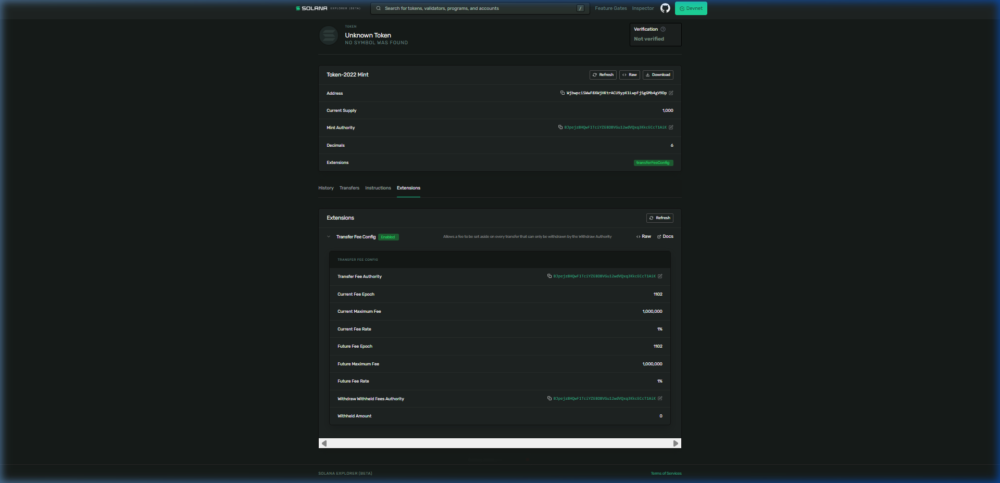

# Day 50: Create a fee-bearing token with Token-2022 🪙

Today, I created a Solana token on devnet that automatically charges a transfer fee (middleware) at the program level without writing any custom smart contract code, utilizing **SPL Token-2022 Transfer Fee Extension**.

---

## 🏗️ Architecture Flow
```
        [ Transfer Action ] 
                 │
                 ▼
     ┌──────────────────────┐
     │   Token-2022 Mint    │ ◄─── Configured with Transfer Fee Extension
     │                      │
     │  - Rate: 100 bps     │ (1% fee applied natively)
     │  - Max Fee: 1,000,000│ (UI amount fee cap)
     └──────────┬───────────┘
                │
        ┌───────┴───────┐
        ▼               ▼
[ Recipient Acc ]   [ Withheld Fees ] (For creator withdrawal)
```

---

## 🛠️ CLI Execution Steps & Outputs

### 1. Create the Fee-Bearing Token Mint
Set the fee rate to `100 basis points` (1%) and the maximum fee cap to `1,000,000` tokens:
```bash
$ spl-token --program-id TokenzQdBNbLqP5VEhdkAS6EPFLC1PHnBqCXEpPxuEb create-token --transfer-fee-basis-points 100 --transfer-fee-maximum-fee 1000000 --decimals 6

Address:  WjbwpciSWwF8XWjHKtrACU9ypK1LwpFjSgGMb4gV9Dp
Decimals:  6
```

### 2. Create Token Account & Mint Supply
```bash
$ spl-token create-account WjbwpciSWwF8XWjHKtrACU9ypK1LwpFjSgGMb4gV9Dp
Creating account zjR2p6WMQNpGhrQwE9CaT2Nin2KYjHg15tww5p5sGJp

$ spl-token mint WjbwpciSWwF8XWjHKtrACU9ypK1LwpFjSgGMb4gV9Dp 1000
Minting 1000 tokens
  Token: WjbwpciSWwF8XWjHKtrACU9ypK1LwpFjSgGMb4gV9Dp
  Recipient: zjR2p6WMQNpGhrQwE9CaT2Nin2KYjHg15tww5p5sGJp
```

---

## 🔍 On-Chain Extensions Verification
Running `spl-token display WjbwpciSWwF8XWjHKtrACU9ypK1LwpFjSgGMb4gV9Dp` displays:
```yaml
SPL Token Mint
  Address: WjbwpciSWwF8XWjHKtrACU9ypK1LwpFjSgGMb4gV9Dp
  Program: TokenzQdBNbLqP5VEhdkAS6EPFLC1PHnBqCXEpPxuEb
  Supply: 1000000000
  Decimals: 6
  Mint authority: BJpejz8HQwF1TciYZEBD8VGu12wdVQxq3KkcECcT1AiK
  Freeze authority: (not set)
Extensions
  Transfer fees:
    Current fee: 100bps
    Current maximum: 1000000000000
    Config authority: BJpejz8HQwF1TciYZEBD8VGu12wdVQxq3KkcECcT1AiK
    Withdrawal authority: BJpejz8HQwF1TciYZEBD8VGu12wdVQxq3KkcECcT1AiK
    Withheld fees: 0
```

---

## 🔗 Verification Links
*   **Token Mint Address:** [`WjbwpciSWwF8XWjHKtrACU9ypK1LwpFjSgGMb4gV9Dp`](https://explorer.solana.com/address/WjbwpciSWwF8XWjHKtrACU9ypK1LwpFjSgGMb4gV9Dp?cluster=devnet)

---

## 🖼️ Explorer Screenshot
Below is the screenshot showing the Transfer Fee Config expanded in Solana Explorer Devnet:


