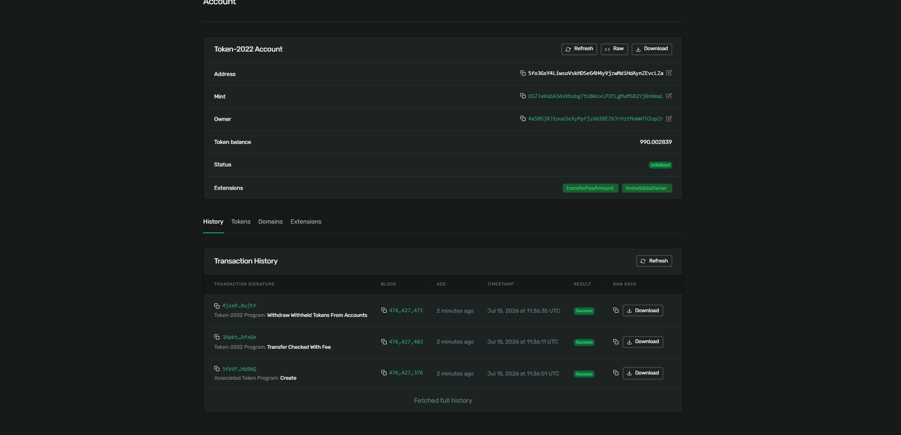

# Day 52: Stack interest accrual on top of your fee-bearing token 📈

Today, I stacked two distinct Token-2022 extensions—**Transfer Fees** and **Interest-Bearing Config**—onto a single token mint on Solana devnet. 

This creates a token that:
1.  Charges a 1% fee every time it is transferred (Transfer Fee).
2.  Accrues 50% APR interest continuously while sitting still in a wallet (Interest-Bearing).

---

## 🛠️ CLI Execution Steps & Outputs

### 1. Create the Multi-Extension Mint
Attached both extensions in a single command.Expressing interest rate `5000` (50% APR) and transfer fee rate `100 bps` (1% fee):
```bash
$ spl-token create-token --program-id TokenzQdBNbLqP5VEhdkAS6EPFLC1PHnBqCXEpPxuEb --decimals 6 --transfer-fee-basis-points 100 --transfer-fee-maximum-fee 1000000 --interest-rate 5000

Address:  GS7JaVubA3AxVbubg7tU8WsxLP2FLgMuMS82Yj8n6maL
Decimals:  6
```

### 2. Verify Configured Extensions on Mint
Running `spl-token display GS7JaVubA3AxVbubg7tU8WsxLP2FLgMuMS82Yj8n6maL` shows both active configurations stacked:
```yaml
Extensions
  Interest-bearing:
    Current rate: 5000bps
    Average rate: 5000bps
    Rate authority: BJpejz8HQwF1TciYZEBD8VGu12wdVQxq3KkcECcT1AiK
  Transfer fees:
    Current fee: 100bps
    Current maximum: 1000000000000
    Config authority: BJpejz8HQwF1TciYZEBD8VGu12wdVQxq3KkcECcT1AiK
    Withdrawal authority: BJpejz8HQwF1TciYZEBD8VGu12wdVQxq3KkcECcT1AiK
    Withheld fees: 0
```

### 3. Create Token Account & Mint 1,000,000 Tokens
```bash
$ spl-token create-account GS7JaVubA3AxVbubg7tU8WsxLP2FLgMuMS82Yj8n6maL
Creating account 4jDHPMv2KZWn2UUhzQrPH5vao3sMkS4VPEe1mr5KdwDv

$ spl-token mint GS7JaVubA3AxVbubg7tU8WsxLP2FLgMuMS82Yj8n6maL 1000000
```

### 4. Observe Interest Accrual (UI Amount drifting upward)
Running `spl-token display` twice, 30 seconds apart, demonstrates the compounding interest behavior. Notice that the balance grows on-chain automatically without any transaction execution:
*   **Initial Snapshot:**
    ```yaml
    SPL Token Account
      Address: 4jDHPMv2KZWn2UUhzQrPH5vao3sMkS4VPEe1mr5KdwDv
      Balance: 1000000.332734
    ```
*   **30 Seconds Later:**
    ```yaml
    SPL Token Account
      Address: 4jDHPMv2KZWn2UUhzQrPH5vao3sMkS4VPEe1mr5KdwDv
      Balance: 1000000.730303
    ```

### 5. Send Tokens to Recipient (Transfer Fee + Recipient Interest Accrual)
Generated recipient keypair (`4a5NSj8Jtouo5eXyPpfjydd28EZhJrHztMnWmTV2opZr`), created their associated account (`5fo3GxY4LiwsoVskHDSeG4H4yVjzwMdiHdAynZEvcLZa`), and sent `1,000` tokens:
```bash
$ spl-token transfer GS7JaVubA3AxVbubg7tU8WsxLP2FLgMuMS82Yj8n6maL 1000 4a5NSj8Jtouo5eXyPpfjydd28EZhJrHztMnWmTV2opZr --expected-fee 10 --allow-unfunded-recipient
```
*   Running `spl-token display 5fo3GxY4LiwsoVskHDSeG4H4yVjzwMdiHdAynZEvcLZa` shows the recipient account received `990` tokens (`10` withheld as a transfer fee), and their balance was already drifting upward:
    ```yaml
    Extensions:
      Immutable owner
      Transfer fees withheld: 10000000 # 10 tokens withheld
    Balance: 990.000329 # Recipient balance drifting upwards via compounding
    ```

### 6. Sweep Withheld Fees
Drained the withheld fees back to our main wallet successfully:
```bash
$ spl-token withdraw-withheld-tokens 4jDHPMv2KZWn2UUhzQrPH5vao3sMkS4VPEe1mr5KdwDv 5fo3GxY4LiwsoVskHDSeG4H4yVjzwMdiHdAynZEvcLZa
Signature: 4jsePHhnphojZCxdCB2FY2a7r2zhKzZsTTffVoZQgXSfCQBg7j3aYJxf87xU5h3dDj23Zmqot5SKBoprK3bRojtY
```

---

## 🔗 Verification Links
*   **Token Mint Address:** [`GS7JaVubA3AxVbubg7tU8WsxLP2FLgMuMS82Yj8n6maL`](https://explorer.solana.com/address/GS7JaVubA3AxVbubg7tU8WsxLP2FLgMuMS82Yj8n6maL?cluster=devnet)
*   **Recipient Token Account:** [`5fo3GxY4LiwsoVskHDSeG4H4yVjzwMdiHdAynZEvcLZa`](https://explorer.solana.com/address/5fo3GxY4LiwsoVskHDSeG4H4yVjzwMdiHdAynZEvcLZa?cluster=devnet)

---

## 🖼️ Explorer Screenshot
Below is the screenshot showing the recipient's Interest-Bearing Account on Solana Explorer Devnet with the updated balance accruing over time:


