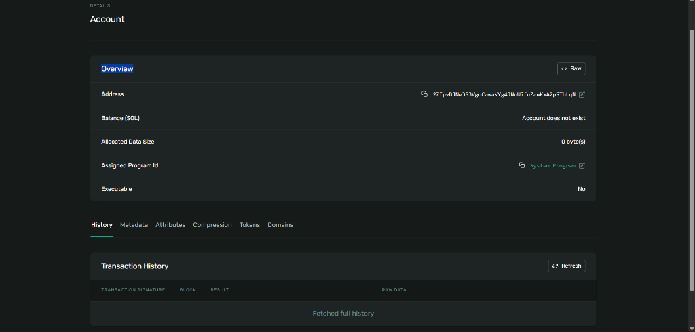
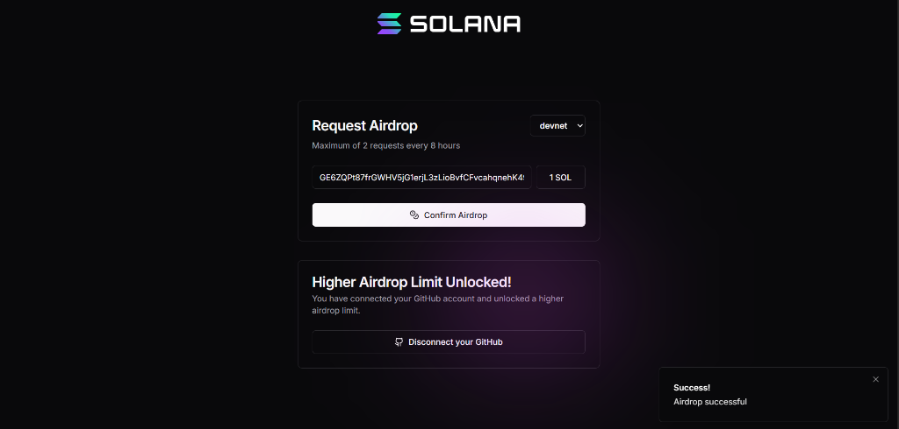
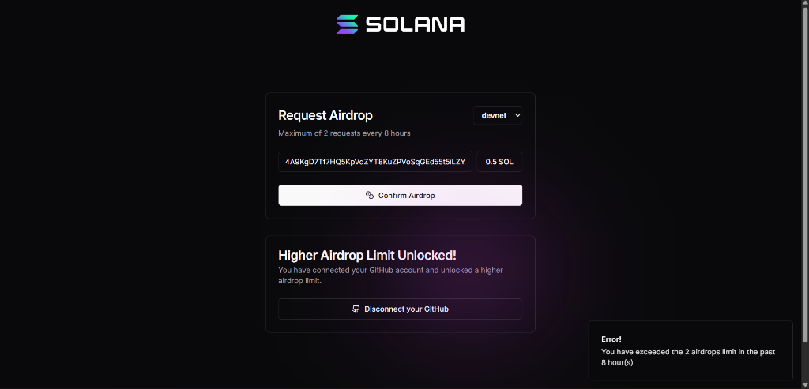
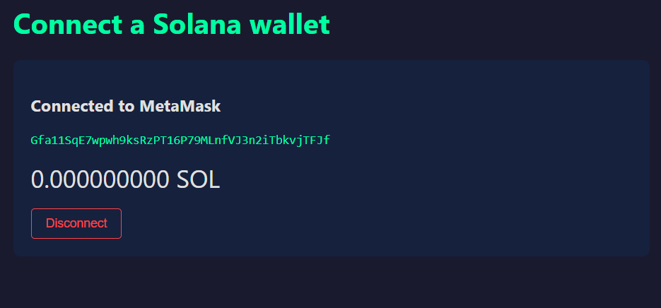

# 100daysofsolana

My journey learning Solana development over 100 days.

## Day 1: Identity and Your First Wallet
*   Generated a Solana keypair programmatically using `@solana/kit`.
*   Address: `2ZEpvBJNv3S3VguCawakYg4JNuUifuZawKxA2pSTbLqN`
*   Funded it on Devnet using the Solana Faucet.

### Devnet Wallet Balance Screenshot

---

## Day 2: Persistent Wallet
*   Built a reusable wallet script `persistent-wallet.mjs` that saves keypair bytes to `wallet.json` and loads it on subsequent runs.
*   Address: `GE6ZQPt87frGWHV5jG1erjL3zLioBvfCFvcahqnehK49`
*   Funded the persistent address via the Solana Faucet to obtain 1 SOL.

### Devnet Wallet Balance Screenshot (Day 2)

---

## Day 3: Understand SOL and Lamports
*   Learned the relationship: `1 SOL = 1,000,000,000 Lamports`.
*   Created a script to verify wallet balances in both SOL and Lamports.
*   Address: `4A9KgD7Tf7HQ5KpVdZYT8KuZPVoSqGEd55t5iLZYX6sE`
*   **Resolution of Faucet Rate Limits:** When the faucet returned a 429 rate limit error, we performed a CLI transfer of 0.5 SOL from our Day 2 wallet to the Day 3 wallet using transaction signature `3E6G5QRnZ4fxafme4X4tm6djF5oypduA8fiva7GG2sJck2NXhtpogeD63rdRgAK6Q45c8r9YFBqAH16aZLi8D4TA`.
*   Verified the base transfer transaction fee of **5,000 Lamports** (0.000005 SOL) via `solana confirm`.

### Math Derivation Proof:
*   **SOL to Lamports:** `0.5 SOL * 1,000,000,000 = 500,000,000 Lamports`
*   **Lamports to SOL:** `500,000,000 Lamports / 1,000,000,000 = 0.5 SOL`

### Devnet Wallet Balance Screenshot (Day 3)

---

## Day 4: Connect a Browser Wallet
*   Built a browser app that discovers installed Solana-compatible wallets using the `@wallet-standard/app` Wallet Standard API.
*   Connected to the wallet securely using the standard connect features with explicit user approval.
*   Address: `Gfa11SqE7wpwh9ksRzPT16P79MLnfVJ3n2iTbkvjTFJf`
*   Fetched and displayed the real-time Devnet balance using the `@solana/kit` RPC client.

### Browser Wallet Connection Screenshot

