# 100daysofsolana

My journey learning Solana development over 100 days.

## Day 1: Identity and Your First Wallet
*   Generated a Solana keypair programmatically using `@solana/kit`.
*   Address: `2ZEpvBJNv3S3VguCawakYg4JNuUifuZawKxA2pSTbLqN`
*   Funded it on Devnet using the Solana Faucet.

### Devnet Wallet Balance Screenshot


---

## Day 2: Persistent Wallet
*   Built a reusable wallet script `persistent-wallet.mjs` that saves keypair bytes to `wallet.json` and loads it on subsequent runs.
*   Address: `GE6ZQPt87frGWHV5jG1erjL3zLioBvfCFvcahqnehK49`
*   Funded the persistent address via the Solana Faucet to obtain 1 SOL.

### Devnet Wallet Balance Screenshot (Day 2)


---

## Day 3: Understand SOL and Lamports
*   Learned the relationship: `1 SOL = 1,000,000,000 Lamports`.
*   Created a script to verify wallet balances in both SOL and Lamports.
*   Address: `4A9KgD7Tf7HQ5KpVdZYT8KuZPVoSqGEd55t5iLZYX6sE`
*   **Resolution of Faucet Rate Limits:** When the faucet returned a 429 rate limit error, we performed a CLI transfer of 0.5 SOL from our Day 2 wallet to the Day 3 wallet using transaction signature `3E6G5QRnZ4fxafme4X4tm6djF5oypduA8fiva7GG2sJck2NXhtpogeD63rdRgAK6Q45c8r9YFBqAH16aZLi8D4TA`.
*   Verified the base transfer transaction fee of **5,000 Lamports** (0.000005 SOL) via `solana confirm`.

### Math Derivation Proof:
*   **SOL to Lamports:** `0.5 SOL * 1,000,000,000 = 500,000,000 Lamports`
*   **Lamports to SOL:** `500,000,000 Lamports / 1,000,000,000 = 0.5 SOL`

### Devnet Wallet Balance Screenshot (Day 3)


---

## Day 4: Connect a Browser Wallet
*   Built a browser app that discovers installed Solana-compatible wallets using the `@wallet-standard/app` Wallet Standard API.
*   Connected to the wallet securely using the standard connect features with explicit user approval.
*   Address: `Gfa11SqE7wpwh9ksRzPT16P79MLnfVJ3n2iTbkvjTFJf`
*   Fetched and displayed the real-time Devnet balance using the `@solana/kit` RPC client.

### Browser Wallet Connection Screenshot


---

## Day 5: Explore Different Wallet Types
*   Set up and compared three different wallet types hands-on: CLI wallet, browser extension wallet, and mobile wallet.
*   Analyzed the hot vs. cold and custodial vs. non-custodial tradeoffs in Solana key management.
*   Built and launched an interactive **Solana Wallet Explorer & Reflection Hub** on localhost.

### Wallet Explorer Dashboard Screenshot (Day 5)
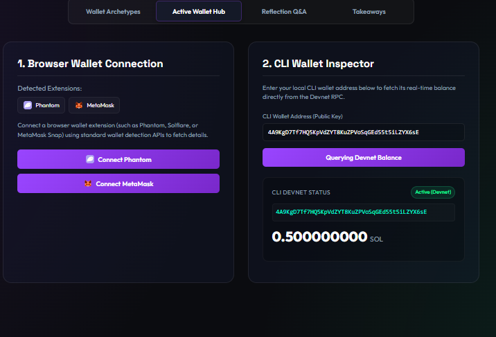

---

## Day 6: Share your experiences on DEV (On-Chain Identity)
*   Drafted and published a technical blog post explaining on-chain identity to Web2 developers.
*   Explained how Solana uses cryptographic Ed25519 keypairs (similar to SSH keys) as the primary identity anchor instead of centralized database records.
*   Explored Base58 address encoding and sovereign non-custodial ownership patterns.

---

## Day 7: Share your wallet experiments and amplify others
*   Shared our progress and takeaways from Week 1 of the #100DaysOfSolana challenge with the community.
*   Created engagement templates and connected with peer developers to discuss wallet archetypes, hot vs. cold storage, and Base58 usability.

---

## Day 8: Read your first on-chain data
*   Connected to the public Solana Devnet via RPC using the new `@solana/kit` and fetched the balance of our local CLI wallet address.
*   Built a client-side interactive **On-Chain Data Inspector** dashboard on localhost that allows users to fetch the balance of any Solana public address in real-time.

### On-Chain Inspector Dashboard Screenshot (Day 8)
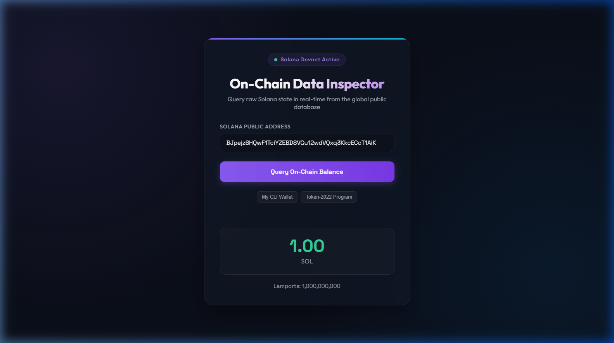

---

## Day 9: Fetch and display recent transactions
*   Connected to the public Solana Devnet via RPC using the new `@solana/kit` and fetched the 5 most recent transaction signatures for the Token-2022 Program address.
*   Built an interactive **Transaction Inspector** dashboard on localhost (`localhost:5174`) to inspect transaction details in a list showing slots, signatures, status badges, and Unix timestamps.

### Transaction Inspector Dashboard Screenshot (Day 9)
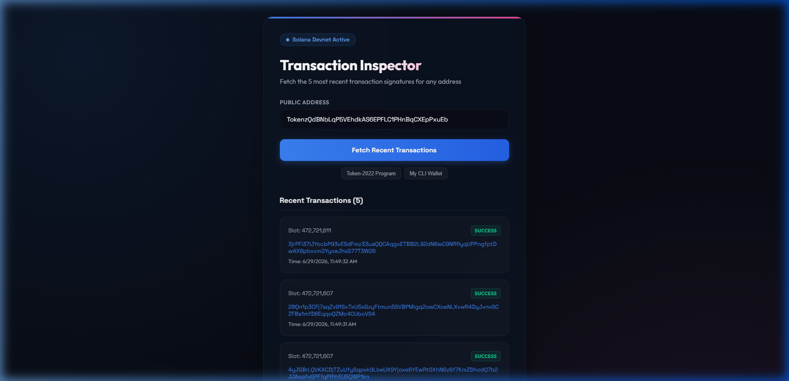

---

## Day 10: Build a simple dashboard in the browser
*   Created a vanilla web dashboard using Vite, bundling `@solana/kit` directly for client-side use.
*   Implemented live data fetching to query both the SOL balance and the 5 most recent transactions for any inputted Solana address dynamically.
*   Added full try/catch error handling to display user-friendly warnings for bad addresses or network outages.

### Solana Devnet Dashboard Screenshot (Day 10)
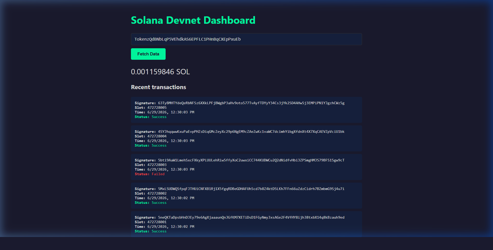

---

## Day 11: Compare accounts vs databases
*   Analyzed how Solana’s account-centric model (combining code and state in a single model) differs from traditional Web2 databases.
*   Used the Solana CLI to inspect local wallet accounts, executable program accounts (Token Program), and verified the linear scaling property of the rent-exemption model.
*   Built a comprehensive comparison matrix detailing storage location, schemas, access control, billing, reads/writes, and visibility behaviors.

### Account Inspector Dashboard Screenshots (Day 11)
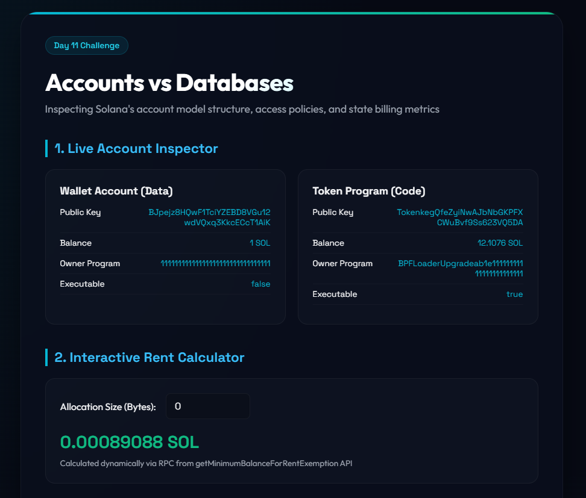
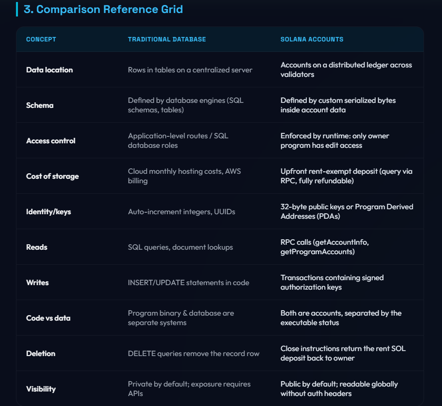

---

## Day 12: Compare data across devnet and mainnet
*   Queried the same target address (Token-2022 Program) across two separate RPC environments: Devnet and Mainnet-Beta.
*   Constructed a side-by-side terminal verification script comparing balances and transaction histories on each network.
*   Documented why public Mainnet-Beta RPC endpoints restrict web browsers with 403 Forbidden CORS blocks, whereas Node.js server connections work without origin issues.

### Cross-Network Inspector Dashboard Screenshot (Day 12)
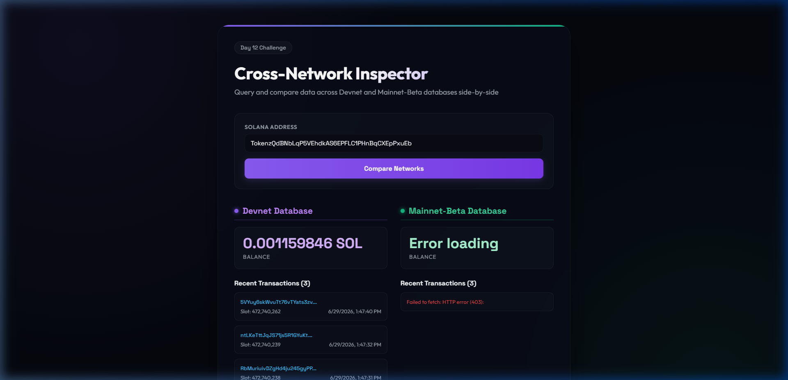

---

## Day 13: Write about your second week
*   Drafted and compiled a technical blog post summarizing Week 2 reflections of the #100DaysOfSolana journey.
*   Reflected on working with browser RPC APIs, migrating terminal scripts to dashboards, learning the structural differences between Web2 databases and Solana accounts, and navigating cross-origin CORS limitations on production mainnet networks.

---

## Day 14: Share your work on social media
*   Compiled our Week 2 deliverables and shared the cross-network dashboard comparison milestones on Twitter/X to engage with the developer community.
*   Created templates and structured screenshots showcasing our interactive client-side query dashboards.

---

## Day 15: Understand transaction anatomy
*   Executed a devnet transfer transaction and dissected the compiled transaction structure using `solana confirm -v`.
*   Mapped transaction elements (Signatures, Header, Account Keys, Recent Blockhash, and Instructions) to HTTP headers/payload components to build a strong analogy.
*   Analyzed size constraints like the 1,232-byte MTU limit that dictate Solana transaction sizes.

### Transaction Explorer Screenshot (Day 15)
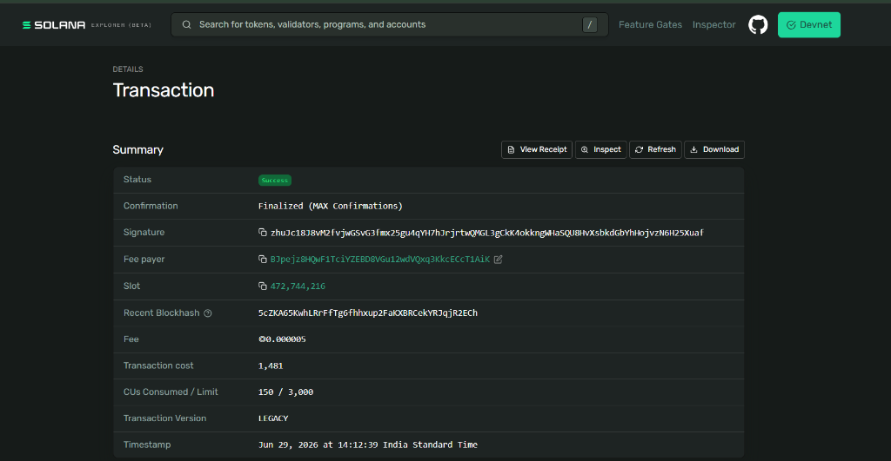

---

## Day 16: Send your first SOL transfer
*   Set devnet cluster and executed a deliberate transfer transaction of `0.5 SOL` to a newly generated recipient wallet using `solana transfer`.
*   Verified settlement times (~400ms) and explored the architectural purpose of the `--allow-unfunded-recipient` flag (allocating account rent deposits).
*   Verified updated balances on-chain for both sender and recipient wallets via CLI.

### Transfer Transaction Explorer screenshots (Day 16)
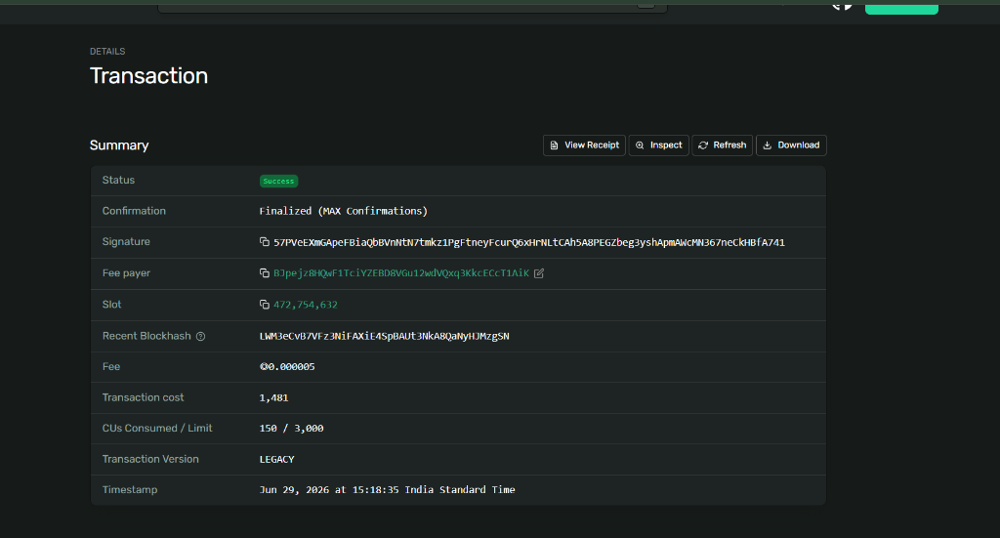
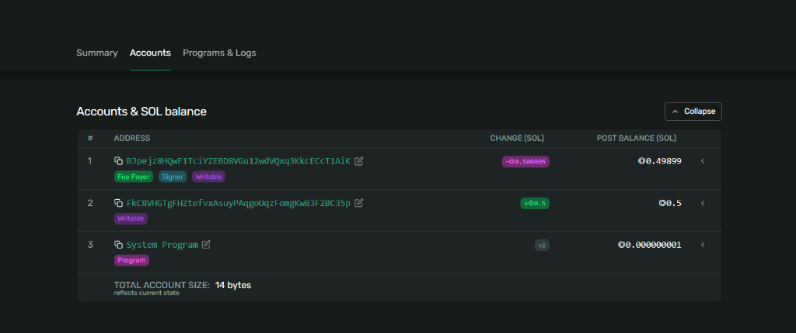
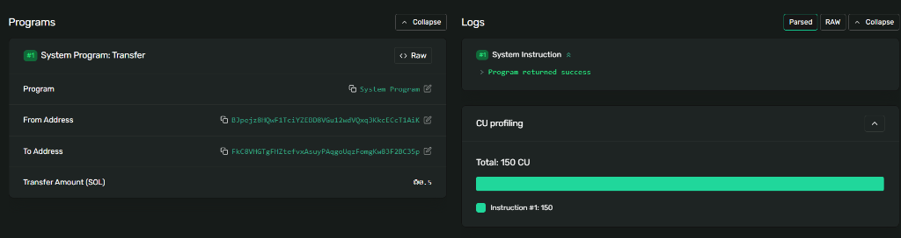
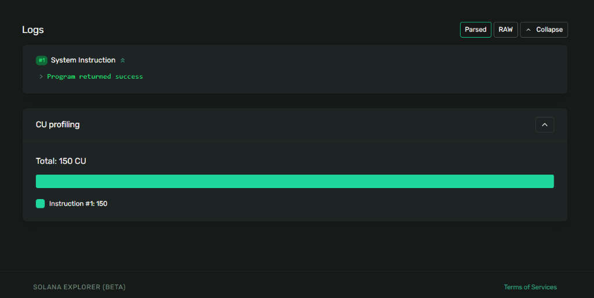

---

## Day 17: Build a transfer tool
*   Created a command-line transfer tool using the modern `@solana/kit` and `@solana-program/system` modules.
*   Implemented sender keypair resolution, input sanitization, and pre-flight balance checking logic to save transaction fee overhead.
*   Monitored confirmations dynamically via RPC subscriptions and rendered the completed details link directly to Solana Explorer.

### Transfer Tool Explorer screenshots (Day 17)


---

## Day 18: Add transaction confirmation UI
*   Extended our programmatic transfer tool using `@solana/kit` to track confirmation progression in real-time.
*   Bypassed the opaque default helper to manually broadcast signed transactions via `getBase64EncodedWireTransaction` and `rpc.sendTransaction()`.
*   Implemented a polling loop (`waitForCommitment`) using `getSignatureStatuses` to track the transaction climbing consensus stages: **Processed**, **Confirmed**, and **Finalized**.

### Dynamic UI Confirmation Screenshots (Day 18)
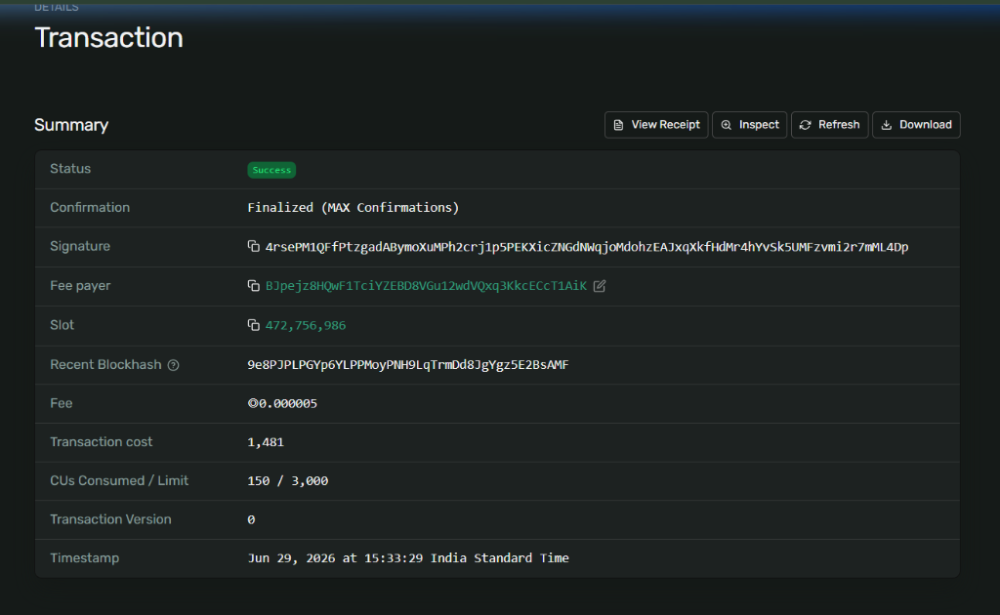
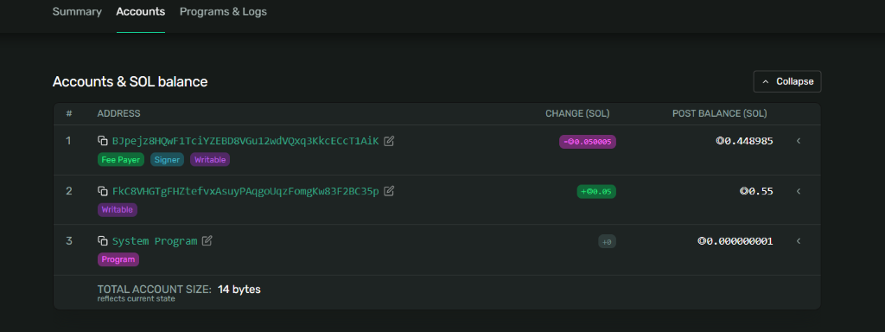
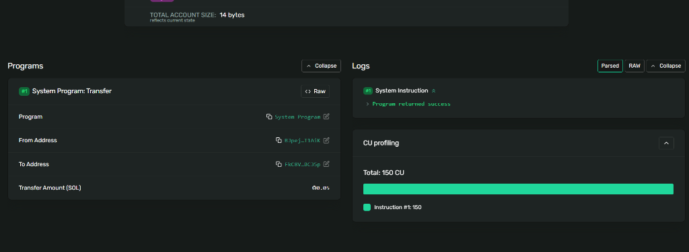

---

## Day 19: Explore failed transactions
*   Investigated how transaction failures and on-chain errors settle on the network.
*   Created a script (`force-fail.mjs`) that bypassed client-side preflight simulation (`skipPreflight: true`) to submit an invalid transfer transaction (insufficient SOL balance) on-chain.
*   Verified that failed transactions still cost gas fees since validators do compute work to execute the instruction.
*   Dissected transaction details on-chain using `solana confirm -v` and Solana Explorer, highlighting error codes (`custom program error: 0x1`) and runtime logs.

### Failed Transaction Explorer Screenshots (Day 19)


---

## Day 20: Write about transactions
*   Cemented transaction conceptual understanding by drafting and publishing a technical blog post on DEV.to.
*   Explained transaction anatomy (1,232-byte limit, account keys, signatures, blockhash lifetime), commitment consensus lifecycle (Processed vs Confirmed vs Finalized), and the economics of failed transactions.

---

## Day 21: Share your transfer tool
*   Packaged up our completed real-time CLI transfer tool and shared it with the developer community.
*   Submitted on-chain proof of successful transfer using transaction signature: `HyafdBgDbdwDzStDxCD64Zv6QsRkwrv4hzsea9KNt7VU6fnFnyaQCiJDEaSFE7DF5kwDhdeKiZQP6G6y48ftUHd`.

---

## Day 22: Inspect account data
*   Used the Solana CLI to query on-chain account parameters (`solana account`) on devnet.
*   Compared our personal wallet account, the SPL Token Program account (`TokenkegQfeZyiNwAJbNbGKPFXCWuBvf9Ss623VQ5DA`), and the Native System Program (`11111111111111111111111111111111`).
*   Analyzed the structural elements of Solana accounts: owner programs, executable flags, SOL lamport balances, and data byte allocations.

### Account Inspection Screenshot (Day 22)
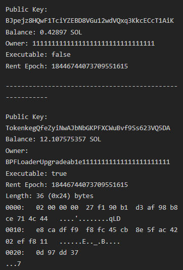

---

## Day 23: Build an account explorer
*   Built a custom command-line account explorer (`explorer.mjs`) from scratch using `@solana/kit` and ES Modules.
*   Implemented live API requests using `getBalance` and `getAccountInfo` to query on-chain account parameters concurrently.
*   Created mapping arrays to translate raw program owners (like `1111...` or `Token...`) into human-readable program names.
*   Added buffer processing to format on-chain base64 account data into structured hex bytes, complete with output length calculations and console truncation guards.

### Account Explorer Screenshot (Day 23)
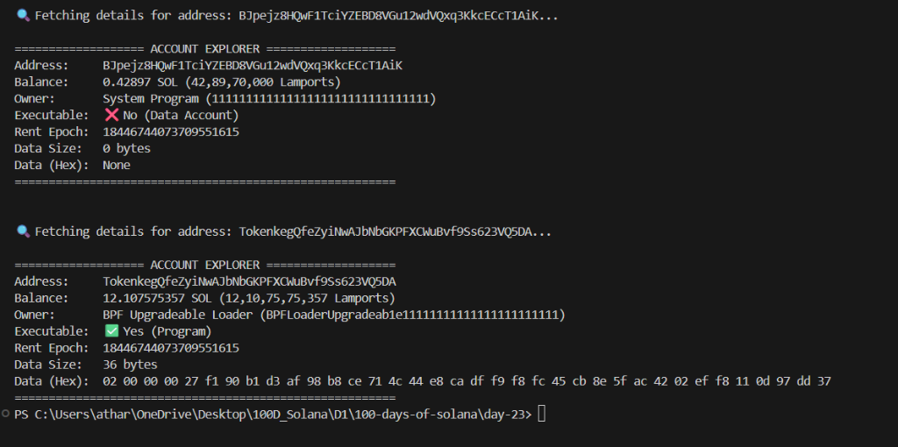

---

## Day 24: Decode account data
*   Implemented on-chain account data decoding for the Wrapped SOL mint address on mainnet.
*   Decoded the 82-byte binary payload using three parallel approaches: `@solana-program/token` Mint Decoder SDK, manual buffer parsing using Javascript `DataView` over the Borsh serialization specification, and server-side RPC `jsonParsed` formatting.
*   Investigated serialization constraints such as little-endian ordering (`true` argument flag in `DataView`), Rust `Option` type representation (`__option` flags), and base58 encoding translation filters for public address bytes.

### Decoded Output Comparison:
```text
🔍 Fetching account data for Wrapped SOL Mint: So11111111111111111111111111111111111111112...
Raw data length: 82 bytes

--- [1] Decoded using @solana-program/token Mint Decoder ---
{
  mintAuthority: { __option: 'None' },
  supply: '0',
  decimals: 9,
  isInitialized: true,
  freezeAuthority: { __option: 'None' }
}

--- [2] Manual Byte-level Parsing (Borsh) ---
{
  mintAuthority: { __option: 'None' },
  supply: '0',
  decimals: 9,
  isInitialized: true,
  freezeAuthority: { __option: 'None' }
}

--- [3] Decoded Server-Side via RPC jsonParsed ---
{
  mintAuthority: { __option: 'None' },
  supply: '0',
  decimals: 9,
  isInitialized: true,
  freezeAuthority: { __option: 'None' }
}

✅ All decoders matched successfully!
```

---

## Day 25: Explore system program accounts
*   Inspected native Solana system accounts, program accounts, and cluster configuration variables (sysvars) on devnet using the Solana CLI.
*   Analyzed the structural differences between:
    *   **System Accounts (Wallets):** Non-executable, 0 bytes data length, owned by System Program (`1111...`).
    *   **Native Program Accounts:** Executable, owned by Native Loader (`NativeLoader1111...`).
    *   **Sysvar Accounts:** Read-only system state (e.g. `SysvarC1ock...`), owned by Sysvar (`Sysvar1111...`).

### Account Types Exploration Screenshot (Day 25)
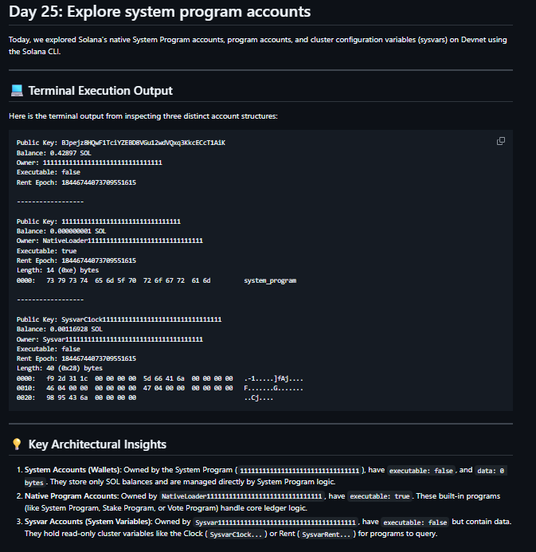

---

## Day 26: Explore Solana Explorer
*   Used the web-based Solana Explorer on Mainnet-Beta to explore on-chain program schemas and activity.
*   Analyzed the **Token-2022 Program** (`TokenzQdBNbXt8TuTRCEjrpb5764uWo1tz5SQH376BB`) executable states, upgrade records, and BPF Upgradeable Loader allocations.
*   Explored the separation of the main Program ID address and the mutable Program Data Account (`3zcpeKk...`) which stores compiled smart contract bytecode.


